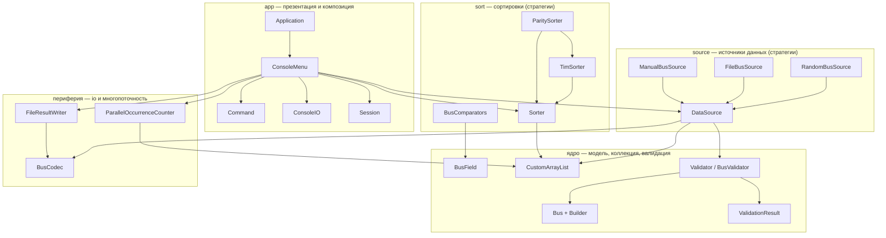
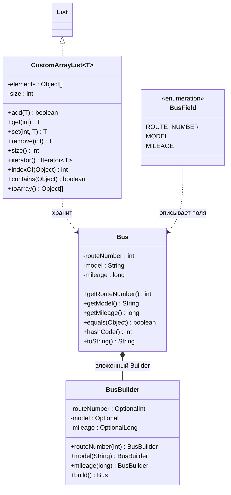
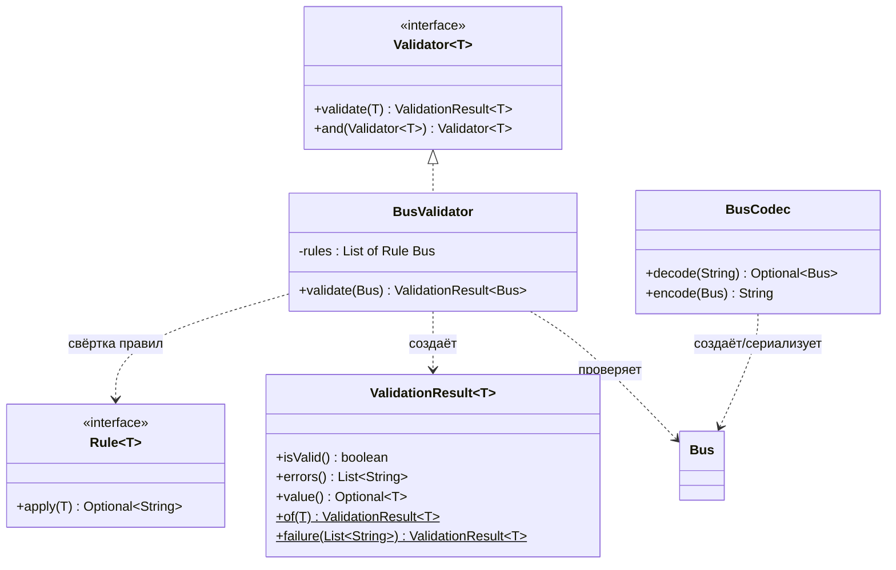
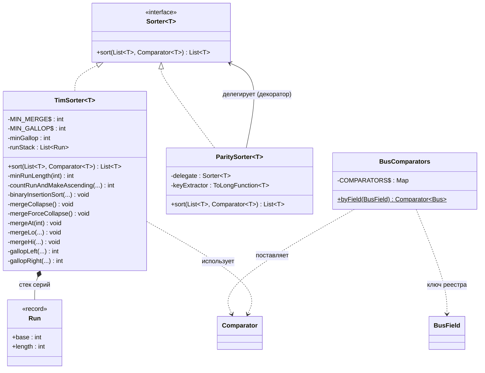
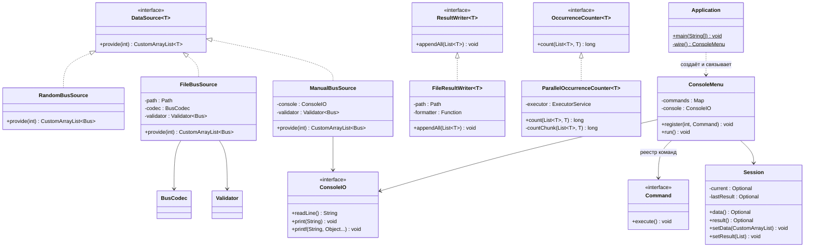
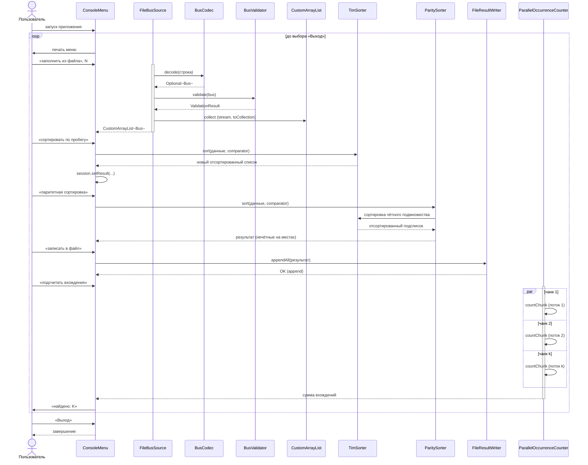
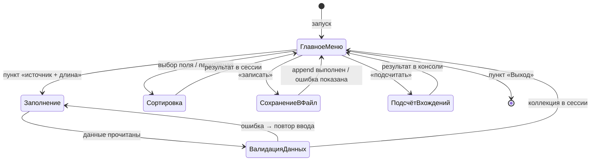
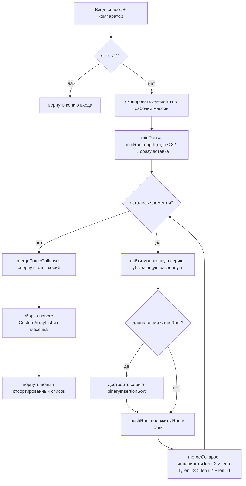
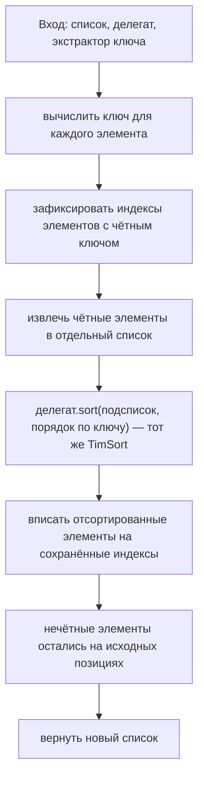

# Архитектура приложения «TimSort Console»

## 1. Общее описание и технологические рамки

Приложение представляет собой консольную утилиту на Java 17+, собираемую средствами Maven. Используется исключительно стандартная библиотека (плюс JUnit 5 для тестов) — это прямое следствие запрета на готовые реализации сортировки, поиска и паттернов: TimSort, бинарный поиск внутри него, сортировка вставками, подсчёт вхождений и все паттерны реализуются вручную, без Lombok и сторонних фреймворков.

В качестве сортируемого класса выбран **Автобус** с полями `routeNumber` (номер маршрута, `int`), `model` (модель, `String`), `mileage` (пробег, `long`). Выбор обусловлен тем, что два из трёх полей числовые, что естественно покрывает дополнительное задание 1 (паритетная сортировка по числовому полю), а строковое поле демонстрирует лексикографическое сравнение.

Общая архитектурная идея — **functional core / imperative shell**: всё вычислительное ядро (валидация, сортировка, генерация данных, подсчёт) оформлено как чистые, иммутабельные, композируемые функции и классы, а «нечистая» периферия (консоль, файлы, потоки выполнения, меню-цикл) изолирована в тонкой внешней оболочке и отделена от ядра интерфейсами.

## 2. Слои и направление зависимостей

Приложение делится на пять слоёв. Слой презентации (`app`) содержит точку входа, меню-цикл и абстракцию консоли. Слой источников данных (`source`) отвечает за наполнение коллекции тремя способами. Ядро (`model`, `collection`, `validation`, `sort`) содержит доменную модель, кастомную коллекцию, валидацию и сортировки. Периферия (`io`, `concurrent`) занимается записью в файл и многопоточным подсчётом. Все зависимости направлены от периферии к ядру и только через интерфейсы; конкретные реализации связываются в единственной точке — классе `Application` (composition root, ручное внедрение зависимостей через конструкторы). Ни один класс ядра не знает о существовании консоли, файлов или меню.

## 3. Пакетная структура

```
com.example.timsort
├── app          — Application, ConsoleMenu, Command, ConsoleIO, Session
├── model        — Bus, Bus.Builder (вложенный), BusField (enum)
├── collection   — CustomArrayList<T>
├── validation   — Validator<T>, Rule<T>, ValidationResult<T>, BusValidator
├── source       — DataSource<T>, RandomBusSource, FileBusSource, ManualBusSource
├── codec        — BusCodec (строка ⇄ объект)
├── sort         — Sorter<T>, TimSorter<T>, ParitySorter<T>, Run, BusComparators
├── io           — ResultWriter<T>, FileResultWriter<T>
└── concurrent   — OccurrenceCounter<T>, ParallelOccurrenceCounter<T>
```

Каждый пакет соответствует одной ответственности слоя, что делает структуру читаемой и облегчает распределение работы по веткам участников (см. раздел о Git).

## 4. Доменная модель

`Bus` — полностью иммутабельный класс: все поля `final`, геттеры без сеттеров, реализованы `equals`/`hashCode` по всем трём полям (это необходимо для корректного подсчёта вхождений в дополнительном задании 4) и `toString`. Создание возможно только через вложенный статический **Builder**, реализованный вручную: методы `routeNumber(int)`, `model(String)`, `mileage(long)` возвращают сам билдер (текучий интерфейс), а `build()` собирает объект и проверяет, что все поля заданы (иначе — исключение времени сборки). Enum `BusField` с константами `ROUTE_NUMBER`, `MODEL`, `MILEAGE` служит типобезопасным ключом для выбора компаратора и пункта меню, исключая «магические строки».

## 5. Кастомная коллекция

`CustomArrayList<T>` — собственная реализация интерфейса `List<T>` на динамическом массиве `Object[]` с ростом ёмкости в 1,5 раза. Реализуются все ключевые операции (`add`, `get`, `set`, `remove`, `size`, `isEmpty`, `iterator`, `indexOf`, `contains`, `toArray`), причём поисковые методы (`indexOf`, `contains`) написаны вручную циклом — готовый поиск не используется. Реализация контракта `List` позволяет передавать коллекцию в стандартный Stream API (`stream()`, `Collectors.toCollection(CustomArrayList::new)`), чем закрывается требование «стримы + кастомные коллекции» (задания 3 и 3*), и при этом коллекция остаётся единственным контейнером данных во всём приложении.

## 6. Валидация

Валидация построена функционально. Базовый блок — `Rule<T>`, функциональный интерфейс вида `Function<T, Optional<String>>`: правило принимает объект и возвращает `Optional` с текстом ошибки, если ограничение нарушено. `Validator<T>` — интерфейс с методом `validate(T): ValidationResult<T>`, снабжённый дефолтным комбинатором `and(Validator<T>)`, что позволяет собирать составные валидаторы композиций. `ValidationResult<T>` — иммутабельный носитель результата с фабриками `of(value)` и `failure(errors)` и методами `isValid()`, `errors()`, `value()` (монадический стиль без исключений в потоке управления).

`BusValidator` собирается из списка правил: номер маршрута — целое в диапазоне 1–999; модель — непустая строка 2–30 символов по шаблону буквы/цифры/дефис/пробел; пробег — целое 0–2 000 000. Политика применения различается по источнику: при чтении из файла невалидные строки пропускаются с предупреждением в консоль (номер строки и причина); при ручном вводе система переспрашивает до корректного значения (с ограничением числа попыток); случайные данные генерируются в валидных границах, но для единообразия прогоняются через тот же валидатор.

## 7. Кодек и форматы файлов

`BusCodec` — чистый класс без состояния с методами `decode(String): Optional<Bus>` и `encode(Bus): String`. Формат строки — CSV с разделителем `;`: `routeNumber;model;mileage` (например, `42;ЛиАЗ-5292;150000`). `decode` выполняет структурную проверку (ровно три колонки) и разбор чисел с обработкой `NumberFormatException`, возвращая `Optional` вместо исключения; семантическую проверку выполняет `Validator` на уровне выше. Тот же кодек используется форматером при записи результатов, что даёт единственную точку определения формата (SRP, DRY).

## 8. Источники данных (стратегии заполнения)

`DataSource<T>` — интерфейс стратегии с методом `provide(int count): CustomList<T>`; пользователь явно выбирает вариант и длину. `RandomBusSource` генерирует данные через стримы: `ThreadLocalRandom` порождает потоки чисел, `Stream.generate`/`mapToObj` собирает автобусы со случайной моделью из пула, результат собирается через `Collectors.toCollection(CustomArrayList::new)`. `FileBusSource` читает файл стримом `Files.lines(path)`, пропускает шапку, декодирует строки кодеком, валидирует и берёт первые `count` валидных записей (если валидных меньше — сообщает об этом). `ManualBusSource` для каждого из `count` элементов читает три поля с консоли через абстракцию `ConsoleIO`, собирает объект билдером и в случае ошибки валидации повторяет ввод. Все три реализации завязаны только на интерфейсы `Validator` и `BusCodec`, полученные через конструктор.

## 9. Слой сортировки

`Sorter<T>` — интерфейс паттерна **Стратегия**: `List<T> sort(List<T> data, Comparator<T> comparator)`. Контракт принципиален для функционального стиля: метод **не мутирует вход**, а возвращает новый отсортированный список (чистая функция).

`TimSorter<T>` — собственная реализация алгоритма Тима Питерса. Внутри вход копируется в рабочий массив, далее: вычисляется `minRunLength` (при размере менее `MIN_MERGE = 32` массив целиком обрабатывается одной бинарной вставкой; иначе minrun лежит в диапазоне 32–64 по старшим битам длины); слева направо выделяются монотонные серии (`countRunAndMakeAscending`, строго убывающие разворачиваются), короткие серии достраиваются до minrun бинарной сортировкой вставками (собственной, с собственным бинарным поиском позиции); пары `(base, length)` кладутся в стек иммутабельных записей `Run`; `mergeCollapse` поддерживает инварианты стека `len[i-2] > len[i-1]` и `len[i-3] > len[i-2] + len[i-1]`, сливая только соседние серии и выбирая сторону слива по размерам; слияние (`mergeLo`/`mergeHi`) копирует во временный буфер меньшую сторону; при `MIN_GALLOP = 7` побед подряд включается режим галопирования — `gallopLeft`/`gallopRight` (экспоненциальный поиск диапазона + бинарный поиск, реализовано вручную), порог адаптивно снижается при удачном галопе и растёт при неудачном; финальный `mergeForceCollapse` схлопывает стек, результат упаковывается в новый `CustomArrayList`. Стабильность гарантируется выбором элемента левой серии при равенстве — это важно, так как сортировки по разным полям должны быть предсказуемо стабильными.

`ParitySorter<T>` — декоратор над `Sorter<T>`, закрывающий дополнительное задание 1. Конструктор принимает делегата и `ToLongFunction<T>` — экстрактор числового ключа (в приложении это номер маршрута). Алгоритм: зафиксировать индексы элементов с чётным ключом, извлечь их в отдельный список, отсортировать делегатом (тем же TimSort) по естественному порядку ключа, вписать обратно строго на прежние индексы; элементы с нечётным ключом не сдвигаются.

`BusComparators` — статический реестр `Map<BusField, Comparator<Bus>>`, построенный на `Comparator.comparing(...)` с `thenComparing` (компаратор разрешён заданием). Меню получает компаратор по ключу `BusField`, не зная деталей сравнения. Базовые сортировки по всем трём полям — это три значения реестра и три команды меню, использующие один и тот же `TimSorter`.

## 10. Запись результатов в файл

`ResultWriter<T>` — интерфейс с методом `appendAll(List<T> items)`; `FileResultWriter<T>` реализует его, открывая файл через `Files.write(..., CREATE, APPEND)` — режим добавления обязателен (задание 2). Форматирование элементов делегируется внедрённой функции `Function<T, String>` (по умолчанию — `BusCodec::encode`), перед блоком данных пишется строка-заголовок с меткой времени и признаком сортировки, поэтому повторные сохранения аккуратно накапливаются в одном файле `results.txt`.

## 11. Многопоточный подсчёт вхождений

`OccurrenceCounter<T>` — интерфейс `long count(List<T> data, T target)`; `ParallelOccurrenceCounter<T>` разбивает коллекцию на чанки по `ceil(size / availableProcessors())`, каждый чанк отправляется через `CompletableFuture.supplyAsync` в собственный `ExecutorService` (пул создаётся в composition root и корректно закрывается при выходе). Подсчёт внутри чанка реализован вручную (сравнение через `equals` в цикле/редукции стрима — `Collections.frequency` не используется). Итог агрегируется как сумма частичных результатов, после чего выводится в консоль. Целевой элемент пользователь задаёт тем же ручным вводом, что и в источнике данных (билдер + валидатор), поэтому равенство считается по всем полям.

## 12. Презентация и цикл приложения

`ConsoleIO` — узкий интерфейс консоли (`readLine`, `print`, `printf`), отделяющий логику меню от `System.out`/`Scanner` (тестируемость, DIP). `Command` — функциональный интерфейс `void execute()`; `ConsoleMenu` хранит `Map<Integer, Command>` и в методе `run()` крутит цикл: печать меню, чтение выбора, исполнение команды, повтор — пока не выполнена команда «Выход» (единственный способ завершения, как требует задание). Мутируемое состояние сессии инкапсулировано в `Session`: текущая коллекция `Optional<CustomArrayList<Bus>>` и последний результат сортировки `Optional<List<Bus>>`. Пункты меню:

1. Выход
2. Заполнить коллекцию (подменю: из файла / случайно / вручную; затем длина)
3. Показать текущую коллекцию
4. Сортировать по номеру маршрута
5. Сортировать по модели
6. Сортировать по пробегу
7. Паритетная сортировка по номеру маршрута
8. Записать последний результат в файл (append)
9. Подсчитать вхождения элемента (многопоточно)

## 13. Композиция

`Application.main` — единственное место, где создаются конкретные реализации: кодек, валидатор, сортировщики, компараторы, источники, писатель, счётчик, консоль, сессия и меню; команды регистрируются лямбдами и ссылками на методы (функциональное связывание). Это делает систему открытой к изменению конфигурации без правок остальных классов.

## 14. Соответствие SOLID

1. **SRP** — каждый класс имеет одну причину для изменения: `Bus` хранит данные, `BusCodec` переводит формат, `BusValidator` проверяет, `TimSorter` сортирует, `FileResultWriter` пишет, `ConsoleMenu` управляет диалогом, `ParallelOccurrenceCounter` считает.
2. **OCP** — расширение новыми сортировками, источниками, полями и командами выполняется добавлением новой реализации стратегии или новой записи в реестр (`BusComparators`, карта команд) без модификации существующего кода.
3. **LSP** — `ParitySorter` подставляем вместо любого `Sorter`, honouring контракт «не мутировать вход, уважать компаратор»; все реализации `DataSource` взаимозаменяемы; `CustomArrayList` выполняет полный контракт `List`.
4. **ISP** — интерфейсы минимальны и ролевые: меню не знает о файлах, источники — о сортировках, счётчик — о меню; никто не зависит от «толстых» интерфейсов.
5. **DIP** — все зависимости через абстракции (`Sorter`, `DataSource`, `Validator`, `ResultWriter`, `OccurrenceCounter`, `ConsoleIO`), конкретика внедряется в composition root.

## 15. Функциональный стиль

Ядро написано функционально в разумных пределах: иммутабельные `Bus`, `ValidationResult`, `Run`; чистые функции сортировки (возвращает новый список), валидации и кодирования; правила валидации как `Function<T, Optional<String>>`, свёртываемые стримом в агрегированный результат; высшие функции повсюду — `ParitySorter` принимает `ToLongFunction`, `FileResultWriter` — `Function<T,String>`, меню — лямбды `Command`; наполнение коллекций и подсчёт — через Stream API (`Files.lines`, `Stream.generate`, `IntStream.rangeClosed`, `Collectors.toCollection`); `Optional` вместо null и исключений в потоке управления. Осознанные отступления — «императивная оболочка»: внутренности TimSort (рабочие циклы и мутации массива — природа алгоритма), консольный ввод-вывод и цикл меню.

## 16. Паттерны (все — собственная реализация)

**Стратегия** реализована дважды: семейство `Sorter` (TimSort / паритетный вариант, плюс выбор компаратора как отдельная точка вариации) и семейство `DataSource` (файл / случайные / ручной ввод). **Builder** — ручной билдер `Bus`. **Декоратор** — `ParitySorter` над `Sorter`. **Реестр-фабрика** — `BusComparators` и карта команд меню. **Composition Root** — `Application`. Никакие библиотечные реализации паттернов не задействованы.

## 17. Обработка ошибок

Ошибки пользователя (некорректный пункт меню, неверный формат числа, невалидные данные) обрабатываются локально с повторным запросом и понятным сообщением; невалидные строки файла логируются и пропускаются; ошибки файловой системы при чтении перехватываются, сообщаются пользователю и возвращают его в меню без падения цикла; ошибки записи — аналогично. Исключения не покидают цикл приложения, выход — только через пункт «Выход».

## 18. Тестирование

JUnit 5 покрывает: `TimSorter` на пустых, одноэлементных, отсортированных, обратно отсортированных, «пилообразных» и случайных наборах с эталонной стабильной вставочной сортировкой как оракулом, плюс отдельные тесты стабильности и на дубликатах; `ParitySorter` на фиксации индексов нечётных элементов; `BusValidator` и `BusCodec` (в том числе round-trip); контракт `CustomArrayList`; `ParallelOccurrenceCounter` против последовательного подсчёта на больших коллекциях; билдер на неполной сборке.

## 19. Git-процесс

Репозиторий ведётся на GitHub/GitLab с защищённой веткой `main`. Каждый участник ведёт собственную ветку по своей зоне ответственности (например, `feature/timsort-core`, `feature/data-sources`, `feature/console-ui`, `feature/io-and-concurrency`), минимум по одной ветке на человека; изменения попадают в `main` только через merge/pull request с ревью; в итоге все ветки смержены в `main`. Кодстайл — согласно Java-конвенциям (проверяется в ревью).

---

# UML-диаграммы (Mermaid)

## 1. Компонентная диаграмма (пакеты и зависимости)



## 2. Классы: модель и кастомная коллекция



## 3. Классы: валидация и кодек



## 4. Классы: слой сортировки



## 5. Классы: источники, io, многопоточность, меню



## 6. Диаграмма последовательности: основной сценарий сессии



## 7. Диаграмма состояний: цикл приложения



## 8. Activity-диаграмма: TimSorter.sort



## 9. Activity-диаграмма: ParitySorter.sort (задание 1)



---

Замечание по использованию: все диаграммы написаны на Mermaid и рендерятся напрямую в Markdown (GitHub/GitLab отображают их автоматически), поэтому их удобно держать в `README.md` или `docs/architecture.md` репозитория — это же станет естественной точкой отчётности по архитектуре при защите проекта.