# Архитектура приложения «TimSort Console»

## 1. Общее описание и технологические рамки

Приложение представляет собой консольную утилиту на Java 17+, собираемую средствами Maven. Используется исключительно стандартная библиотека (плюс JUnit 5 для тестов) — это прямое следствие запрета на готовые реализации сортировки, поиска и паттернов: TimSort, бинарный поиск внутри него, сортировка вставками, подсчёт вхождений и все паттерны реализуются вручную, без Lombok и сторонних фреймворков.

В качестве сортируемого класса выбран **Автобус** с полями `routeNumber` (номер маршрута, `int`), `model` (модель, `String`), `mileage` (пробег, `long`). Выбор обусловлен тем, что два из трёх полей числовые, что естественно покрывает дополнительное задание 1 (паритетная сортировка по числовому полю), а строковое поле демонстрирует лексикографическое сравнение.

Общая архитектурная идея — **functional core / imperative shell**: всё вычислительное ядро (валидация, сортировка, генерация данных, подсчёт) оформлено как чистые, иммутабельные, композируемые функции и классы, а «нечистая» периферия (консоль, файлы, потоки выполнения, меню-цикл) изолирована в тонкой внешней оболочке и отделена от ядра интерфейсами.

## 2. Слои и направление зависимостей

Приложение разделено на пять логических слоёв, каждый из которых объединяет пакеты с единой зоной ответственности. Такое разделение обеспечивает слабую связанность и позволяет изменять реализацию одного слоя, не затрагивая другие.

### Слой презентации и композиции (`app`)

Содержит точку входа `Application`, цикл меню `ConsoleMenu`, интерфейс `Command` для команд, абстракцию консоли `ConsoleIO` и хранилище состояния сессии `Session`. Этот слой не реализует бизнес-логику, а лишь организует взаимодействие пользователя с ядром и периферией через интерфейсы. Метод `main` является composition root — единственным местом в приложении, где создаются конкретные реализации всех зависимостей и связываются между собой через конструкторы; все остальные классы получают зависимости извне и не знают, кто и как их создал.

### Слой источников данных (`source`)

Отвечает за наполнение коллекции данными тремя способами: случайная генерация, чтение из файла, ручной ввод. Основная абстракция — интерфейс стратегии `DataSource<T>` с методом `provide(int count)`. Конкретные реализации (`RandomBusSource`, `FileBusSource`, `ManualBusSource`) зависят только от абстракций ядра: `Validator`, `BusCodec`, `CustomArrayList`, а также от `ConsoleIO` для ручного ввода.

### Ядро (пакеты `model`, `collection`, `validation`, `sort`)

Ядро содержит доменную модель `Bus` с билдером, кастомную коллекцию `CustomArrayList`, систему валидации (`Validator`, `Rule`, `ValidationResult`, `BusValidator`) и алгоритмы сортировки (`Sorter`, `TimSorter`, `ParitySorter`, `TimParitySorter`, `BusComparators`). Все классы ядра иммутабельны или предоставляют чистые функции. Они не знают о существовании консоли, файлов, меню или потоков выполнения. Зависимости внутри ядра направлены от более конкретных классов к абстракциям (например, `TimSorter` зависит от `Comparator`, но не наоборот).

### Периферия: ввод-вывод (`io`)

Пакет `io` содержит интерфейс `ResultWriter<T>` и его файловую реализацию `FileResultWriter<T>`, которая умеет добавлять отсортированные коллекции в файл. `FileResultWriter` зависит только от `Function<T, String>` для форматирования (обычно `BusCodec::encode`) и от пути к файлу. Он не зависит от конкретных классов домена или сортировки.

### Периферия: многопоточность (`concurrent`)

Пакет `concurrent` содержит интерфейс `OccurrenceCounter<T>` и реализацию `ParallelOccurrenceCounter<T>`, выполняющую подсчёт вхождений элемента в коллекцию параллельно. Класс получает `ExecutorService` через конструктор (внедряется из composition root) и работает с любым `List<T>`, не зная о его происхождении. Зависимость направлена только к стандартным коллекциям и `equals`.

### Направление зависимостей

Общее правило: **все зависимости направлены от внешних слоёв к ядру**. Ядро не имеет исходящих зависимостей к периферии. Слой `app` является самым внешним: он знает о всех интерфейсах и конкретных реализациях (только в composition root), но конкретные классы остальных слоёв не знают о `app`. Периферийные пакеты (`io`, `concurrent`) зависят от ядра только через стандартные интерфейсы (`List`, `Function`), а не от конкретных классов домена.

#### Типы зависимостей

Когда один класс напрямую использует другой класс в своём коде (импортирует его, вызывает его методы, создаёт его экземпляры через new), это называется **зависимостью на уровне импорта**. Класс знает о существовании другого класса и не может без него работать. Например:

```java
// FileBusSource напрямую использует BusCodec и Validator
import codec.BusCodec;
import validation.Validator;

public class FileBusSource implements DataSource<Bus> {
    private final BusCodec codec;       // знает о BusCodec
    private final Validator<Bus> validator; // знает о Validator

    public CustomArrayList<Bus> provide(int count) {
        // ... вызывает codec.decode(...), validator.validate(...)
    }
}
```

Внедрение через конструктор (Dependency Injection) — второй тип зависимостей, используемых в проекте. Вместо того чтобы класс сам создавал свои зависимости через `new`, мы передаём их снаружи через конструктор. Класс по-прежнему использует зависимость, но уже не отвечает за её создание. Например:

```java
public class ConsoleMenu {
    private final DataSource<Bus> source; // знает только об интерфейсе

    // Зависимость передаётся извне через конструктор
    public ConsoleMenu(DataSource<Bus> source) {
        this.source = source;
    }

    public void run() {
        source.provide(10);
    }
}
```

`ConsoleMenu` не знает, какая именно реализация `DataSource` будет использована — файловая, случайная или ручная. Это решает тот, кто создаёт `ConsoleMenu`.

На диаграмме ниже показаны слои как группы пакетов и стрелки зависимостей между ними. Сплошные стрелки обозначают зависимость на уровне исходного кода (import), пунктирные — внедрение зависимостей через конструкторы в composition root (реализуется только в `app`).

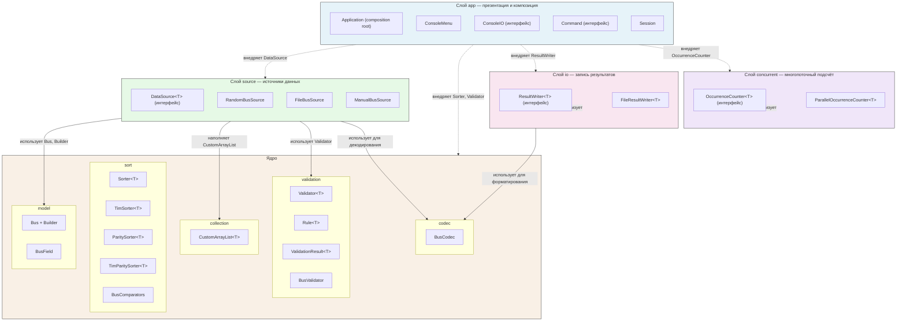


## 3. Пакетная структура

```
com.example.timsort
├── app          — Application, ConsoleMenu, Command, ConsoleIO, Session
├── model        — Bus, Bus.Builder (вложенный), BusField (enum)
├── collection   — CustomArrayList<T>
├── validation   — Validator<T>, Rule<T>, ValidationResult<T>, BusValidator
├── source       — DataSource<T>, RandomBusSource, FileBusSource, ManualBusSource
├── codec        — BusCodec (строка ⇄ объект)
├── sort         — Sorter<T>, TimSorter<T>, ParitySorter<T>, Run, BusComparators
├── io           — ResultWriter<T>, FileResultWriter<T>
└── concurrent   — OccurrenceCounter<T>, ParallelOccurrenceCounter<T>
```

Каждый пакет соответствует одной ответственности слоя, что делает структуру читаемой и облегчает распределение работы по веткам участников (см. раздел о Git).

## 4. Доменная модель

`Bus` — полностью иммутабельный класс: все поля `final`, геттеры без сеттеров, реализованы `equals`/`hashCode` по всем трём полям (это необходимо для корректного подсчёта вхождений в дополнительном задании 4) и `toString`. Создание возможно только через вложенный статический **Builder**, реализованный вручную: методы `routeNumber(int)`, `model(String)`, `mileage(long)` возвращают сам билдер (текучий интерфейс), а `build()` собирает объект и проверяет, что все поля заданы (иначе — исключение времени сборки). Enum `BusField` с константами `ROUTE_NUMBER`, `MODEL`, `MILEAGE` служит типобезопасным ключом для выбора компаратора и пункта меню, исключая «магические строки».

## 5. Кастомная коллекция

`CustomArrayList<T>` — собственная реализация интерфейса `List<T>` на динамическом массиве `Object[]` с ростом ёмкости в 1,5 раза. Реализуются все ключевые операции (`add`, `get`, `set`, `remove`, `size`, `isEmpty`, `iterator`, `indexOf`, `contains`, `toArray`), причём поисковые методы (`indexOf`, `contains`) написаны вручную циклом — готовый поиск не используется. Реализация контракта `List` позволяет передавать коллекцию в стандартный Stream API (`stream()`, `Collectors.toCollection(CustomArrayList::new)`), чем закрывается требование «стримы + кастомные коллекции» (задания 3 и 3*), и при этом коллекция остаётся единственным контейнером данных во всём приложении.

## 6. Валидация

### 1. Назначение

Подсистема предоставляет **универсальный, переиспользуемый каркас для декларативной валидации объектов** и конкретную реализацию для доменного класса `Bus`. Валидация в проекте выполняется при загрузке данных из CSV (`FileBusSource`): каждая строка декодируется в `Bus`, затем проверяется валидатором; невалидные записи пропускаются с предупреждением.

Ключевая характеристика — **накопление всех нарушений за один проход** вместо fail-fast: пользователь получает полный список ошибок, а не первую.

### 2. Архитектурные решения

| Решение | Содержание | Следствие |
|---|---|---|
| Разделение транспорта и семантики | `Bus` — «широкий» носитель данных без инвариантов; `BusCodec` проверяет только синтаксис CSV | Валидатор — **единственный источник бизнес-правил**; все невалидные значения достижимы и тестируемы |
| Без исключений в потоке валидации | `Rule` возвращает `Optional<String>`, `Validator` — `ValidationResult`; null-вход даёт failure, а не NPE | Валидация безопасно вызывается на любых данных |
| Ядро + декларации | `RuleBasedValidator<T>` реализует механику «применить правила, собрать ошибки»; `BusValidator` только объявляет три правила | Новый валидатор для любого класса — одна декларация правил |
| Композиция | `default Validator<T> and(Validator<T>)` | Валидаторы комбинируются, ошибки накапливаются из обоих |
| Иммутабельность | Все типы подсистемы stateless/immutable | Потокобезопасность без синхронизации |

### 3. Структура подсистемы (диаграмма классов)

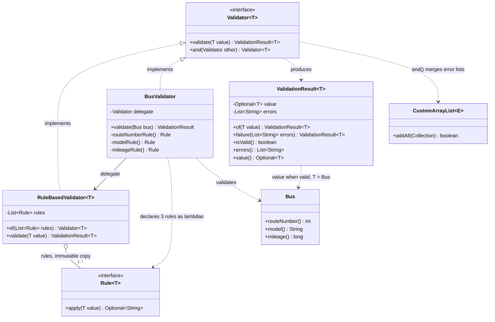

Пояснения к диаграмме:

- `Rule` и `Validator` — функциональные интерфейсы (`@FunctionalInterface`), реализуемые лямбда-выражениями; поэтому конкретные правила (`routeNumberRule` и др.) не показаны как классы — это лямбды, объявленные в `BusValidator`.
- `RuleBasedValidator` агрегирует список правил (`List.copyOf` — защитная копия, порядок фиксирован).
- `BusValidator` делегирует всю механику ядру и сам не содержит логики применения правил.
- `CustomArrayList` (проектная коллекция) используется только в комбинаторе `and` для слияния списков ошибок.

### 4. Основной поток валидации (диаграмма последовательностей)

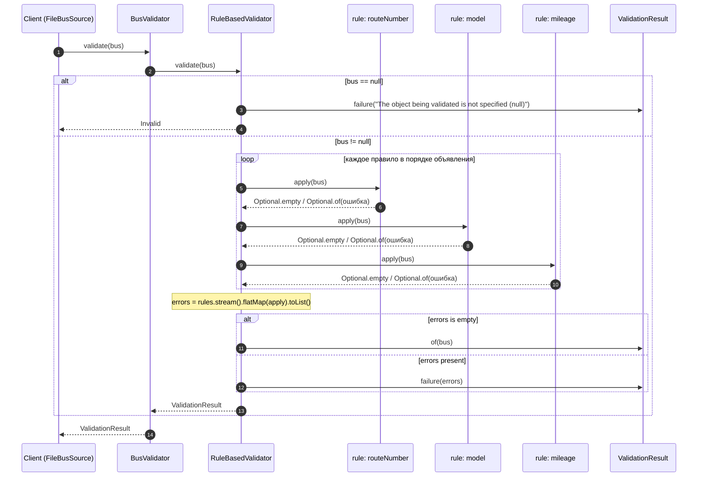

Свойства потока:

- **Порядок ошибок детерминирован**: маршрут → модель → пробег (порядок объявления правил); композиция через `and` добавляет ошибки второго валидатора после первого.
- **Все правила выполняются всегда** — не останавливаемся на первом нарушении.
- **Null-вход** обрабатывается до применения правил.

### 5. Композиция валидаторов: `and` (диаграмма последовательностей)

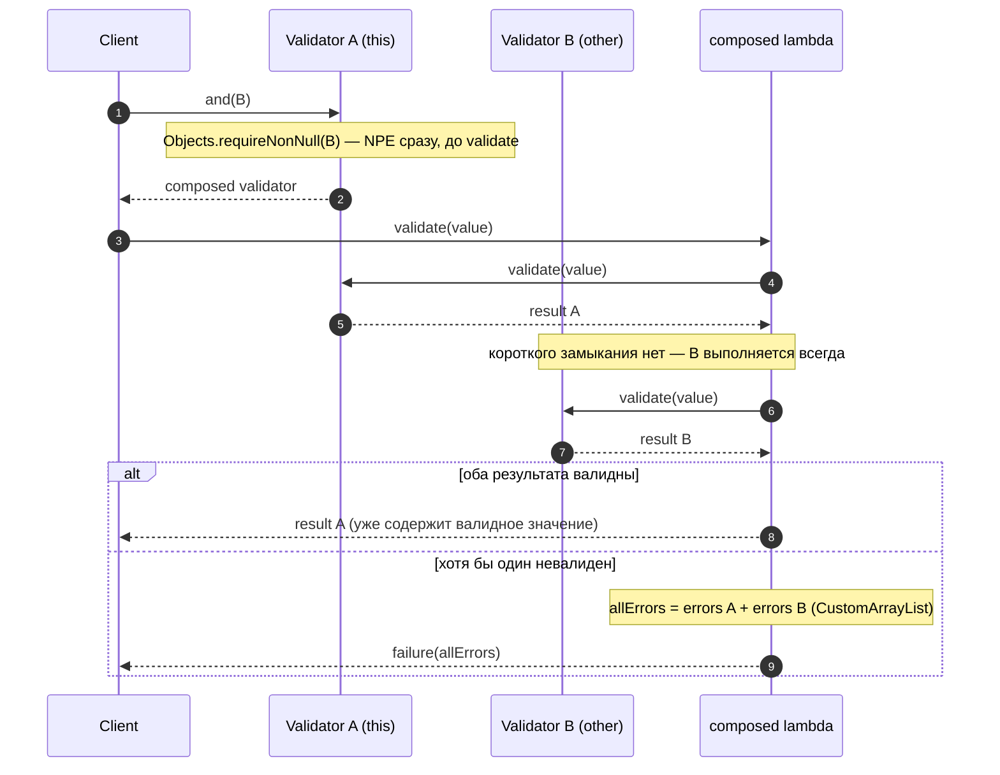

Контракт `and`:

- возвращает **новый** валидатор, исходные не изменяются;
- оба валидатора вычисляются при каждом вызове (накопление ошибок важнее экономии);
- `and(null)` → `NullPointerException` немедленно (ошибка программиста, не данных).

### 6. `ValidationResult` — контракт состояний

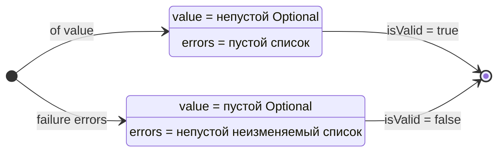

Инварианты класса (гарантируются приватным конструктором + фабриками):

| Инвариант | Обеспечение |
|---|---|
| Валидное значение ⇔ пустой список ошибок | `of` создаёт `List.of()`, `failure` требует непустой список |
| Валидное значение никогда `null` | `of` → `Objects.requireNonNull` (NPE — ошибка программиста, не данных) |
| Список ошибок неизменяем и изолирован | `List.copyOf` в конструкторе: defensive copy + запрет null-элементов |
| Фабрика `failure` требует непустой список | `IllegalArgumentException` при `null`/пустом — защита семантики «Invalid означает хотя бы одну ошибку» |

Исключения здесь — часть **API-контракта фабрик** (ошибки использования), а не потока валидации: сам `validate(...)` на любых входных данных исключений не бросает.

### 7. Контракты классов

#### `Rule<T>` — функциональный интерфейс правила
| Метод | Контракт |
|---|---|
| `Optional<String> apply(T value)` | пустой `Optional` — правило соблюдено; `Optional` с текстом — нарушение |

#### `Validator<T>` — функциональный интерфейс валидатора
| Метод | Контракт |
|---|---|
| `ValidationResult<T> validate(T value)` | для `null`-входа — failure, не исключение |
| `default Validator<T> and(Validator<T> other)` | оба валидатора выполняются всегда; ошибки `this` предшествуют ошибкам `other`; `other == null` → NPE |

#### `RuleBasedValidator<T>` — ядро каркаса
| Элемент | Контракт |
|---|---|
| `static of(List<Rule<T>>)` | фабрика; правила копируются (`List.copyOf`), порядок сохраняется |
| `validate(T)` | `null` → failure с одним сообщением; иначе — все правила, аккумулирование нарушений; успех → `of(value)`, иначе → `failure(errors)` |

#### `BusValidator` — правила домена
Обёртка над `RuleBasedValidator`: три static-фабрики возвращают лямбда-правила; `MODEL_PATTERN` прекомпилирован один раз (`Pattern.compile`), диапазон `а-яА-Я` расширен символами `ёЁ`.

## 8. Бизнес-правила для `Bus`

| Поле | Правило | Сообщение (EN, содержит поле и значение) |
|---|---|---|
| `routeNumber` | целое в диапазоне **1..999** | "The route number must be between 1 and 999, current value: …" |
| `model` | не `null`, не blank, длина **2..30** после `strip()`, соответствует `[а-яА-ЯёЁa-zA-Z0-9\-\s]+` | три сообщения: null/blank, длина, недопустимые символы |
| `mileage` | целое в диапазоне **0..2 000 000** | "Mileage must be between 0 and 2000000, current value: …" |

Особенности правила модели:

- проверяется **нормализованное** значение (`strip()`): `" A"` трактуется как 1-символьная модель, а не валидная 2-символьная;
- проверки идут в порядке null/blank → длина → паттерн; правило возвращает **только первое нарушение** поля (не более одной ошибки на поле);
- проверка null/blank здесь обязательна: `Bus` — широкий носитель и ничего не гарантирует.

## 9. Контекст подсистемы в приложении

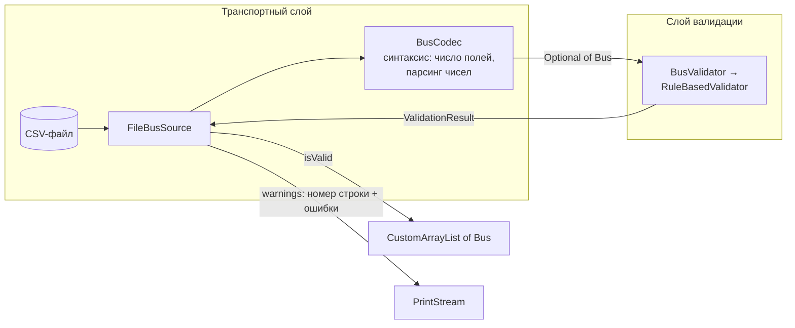

Разделение ответственности: `BusCodec` отвечает за **форму** (строка разбирается или нет), `BusValidator` — за **содержание** (значения допустимы или нет). `FileBusSource` — orchestrator: пропускает валидные записи дальше, невалидные логирует.

## 10. Гарантии и свойства подсистемы

- **Потокобезопасность**: `BusValidator`, `RuleBasedValidator`, `ValidationResult` не имеют изменяемого состояния после создания; инстансы переиспользуемы concurrently.
- **Детерминизм**: порядок ошибок фиксирован (порядок правил; в `and` — `this` затем `other`).
- **Отсутствие исключений в потоке валидации** при любых данных, включая `null`.
- **Иммутабельность результата**: список ошибок нельзя изменить снаружи; результат изолирован от исходного списка.

## 11. Точки расширения

| Сценарий | Как реализуется |
|---|---|
| Валидатор для нового класса `X` | `RuleBasedValidator.of(List.of(ruleX1, ruleX2, …))` — 1 строка на правило |
| Усиление валидации Bus | `busValidator.and(extraValidator)` — ошибки накапливаются из обоих |
| Переход к структурированным ошибкам | замена `String` → тип `ValidationError` в `Rule`/`ValidationResult` (интерфейсы не меняют форму) |
| Локализация сообщений | фабрики правил — единственное место, где формируются тексты |

---

Замечание к диаграммам: у участников sequence-диаграммы `rule: routeNumber` и т.п. — это лямбда-объекты, создаваемые static-фабриками `BusValidator`; как классы они не существуют, что отражает суть каркаса — правила объявляются декларативно, а не наследованием.

## 7. Кодек и форматы файлов

`BusCodec` — чистый класс без состояния с методами `decode(String): Optional<Bus>` и `encode(Bus): String`. Формат строки — CSV с разделителем `;`: `routeNumber;model;mileage` (например, `42;ЛиАЗ-5292;150000`). `decode` выполняет структурную проверку (ровно три колонки) и разбор чисел с обработкой `NumberFormatException`, возвращая `Optional` вместо исключения; семантическую проверку выполняет `Validator` на уровне выше. Тот же кодек используется форматером при записи результатов, что даёт единственную точку определения формата (SRP, DRY).

## 8. Источники данных (стратегии заполнения)

`DataSource<T>` — интерфейс стратегии с методом `provide(int count): CustomList<T>`; пользователь явно выбирает вариант и длину. `RandomBusSource` генерирует данные через стримы: `ThreadLocalRandom` порождает потоки чисел, `Stream.generate`/`mapToObj` собирает автобусы со случайной моделью из пула, результат собирается через `Collectors.toCollection(CustomArrayList::new)`. `FileBusSource` читает файл стримом `Files.lines(path)`, пропускает шапку, декодирует строки кодеком, валидирует и берёт первые `count` валидных записей (если валидных меньше — сообщает об этом). `ManualBusSource` для каждого из `count` элементов читает три поля с консоли через абстракцию `ConsoleIO`, собирает объект билдером и в случае ошибки валидации повторяет ввод. Все три реализации завязаны только на интерфейсы `Validator` и `BusCodec`, полученные через конструктор.

## 9. Слой сортировки

`Sorter<T>` — интерфейс паттерна **Стратегия**: `List<T> sort(List<T> data, Comparator<T> comparator)`. Контракт принципиален для функционального стиля: метод **не мутирует вход**, а возвращает новый отсортированный список (чистая функция).

`TimSorter<T>` — собственная реализация алгоритма Тима Питерса. Внутри вход копируется в рабочий массив, далее: вычисляется `minRunLength` (при размере менее `MIN_MERGE = 32` массив целиком обрабатывается одной бинарной вставкой; иначе minrun лежит в диапазоне 32–64 по старшим битам длины); слева направо выделяются монотонные серии (`countRunAndMakeAscending`, строго убывающие разворачиваются), короткие серии достраиваются до minrun бинарной сортировкой вставками (собственной, с собственным бинарным поиском позиции); пары `(base, length)` кладутся в стек иммутабельных записей `Run`; `mergeCollapse` поддерживает инварианты стека `len[i-2] > len[i-1]` и `len[i-3] > len[i-2] + len[i-1]`, сливая только соседние серии и выбирая сторону слива по размерам; слияние (`mergeLo`/`mergeHi`) копирует во временный буфер меньшую сторону; при `MIN_GALLOP = 7` побед подряд включается режим галопирования — `gallopLeft`/`gallopRight` (экспоненциальный поиск диапазона + бинарный поиск, реализовано вручную), порог адаптивно снижается при удачном галопе и растёт при неудачном; финальный `mergeForceCollapse` схлопывает стек, результат упаковывается в новый `CustomArrayList`. Стабильность гарантируется выбором элемента левой серии при равенстве — это важно, так как сортировки по разным полям должны быть предсказуемо стабильными.

`ParitySorter<T>` — отдельный интерфейс, закрывающий дополнительное задание 1. В отличие от `Sorter<T>`, он не принимает компаратор, а использует `ToLongFunction<T>` для извлечения числового ключа (в приложении это номер маршрута). Конкретная реализация `TimParitySorter<T>` принимает делегата `Sorter<T>` для сортировки извлечённого подмножества. Алгоритм: зафиксировать индексы элементов с чётным ключом, извлечь их в отдельный список, отсортировать делегатом (тем же TimSort) по естественному порядку ключа, вписать обратно строго на прежние индексы; элементы с нечётным ключом не сдвигаются.

`BusComparators` — статический реестр `Map<BusField, Comparator<Bus>>`, построенный на `Comparator.comparing(...)` с `thenComparing` (компаратор разрешён заданием). Меню получает компаратор по ключу `BusField`, не зная деталей сравнения. Базовые сортировки по всем трём полям — это три значения реестра и три команды меню, использующие один и тот же `TimSorter`.

## 10. Запись результатов в файл

`ResultWriter<T>` — интерфейс с методом `appendAll(List<T> items)`; `FileResultWriter<T>` реализует его, открывая файл через `Files.write(..., CREATE, APPEND)` — режим добавления обязателен (задание 2). Форматирование элементов делегируется внедрённой функции `Function<T, String>` (по умолчанию — `BusCodec::encode`), перед блоком данных пишется строка-заголовок с меткой времени и признаком сортировки, поэтому повторные сохранения аккуратно накапливаются в одном файле `results.txt`.

## 11. Многопоточный подсчёт вхождений

`OccurrenceCounter<T>` — интерфейс `long count(List<T> data, T target)`; `ParallelOccurrenceCounter<T>` разбивает коллекцию на чанки по `ceil(size / availableProcessors())`, каждый чанк отправляется через `CompletableFuture.supplyAsync` в собственный `ExecutorService` (пул создаётся в composition root и корректно закрывается при выходе). Подсчёт внутри чанка реализован вручную (сравнение через `equals` в цикле/редукции стрима — `Collections.frequency` не используется). Итог агрегируется как сумма частичных результатов, после чего выводится в консоль. Целевой элемент пользователь задаёт тем же ручным вводом, что и в источнике данных (билдер + валидатор), поэтому равенство считается по всем полям.

## 12. Презентация и цикл приложения

`ConsoleIO` — узкий интерфейс консоли (`readLine`, `print`, `printf`), отделяющий логику меню от `System.out`/`Scanner` (тестируемость, DIP). `Command` — функциональный интерфейс `void execute()`; `ConsoleMenu` хранит `Map<Integer, Command>` и в методе `run()` крутит цикл: печать меню, чтение выбора, исполнение команды, повтор — пока не выполнена команда «Выход» (единственный способ завершения, как требует задание). Мутируемое состояние сессии инкапсулировано в `Session`: текущая коллекция `Optional<CustomArrayList<Bus>>` и последний результат сортировки `Optional<List<Bus>>`. Пункты меню:

1. Выход
2. Заполнить коллекцию (подменю: из файла / случайно / вручную; затем длина)
3. Показать текущую коллекцию
4. Сортировать по номеру маршрута
5. Сортировать по модели
6. Сортировать по пробегу
7. Паритетная сортировка по номеру маршрута
8. Записать последний результат в файл (append)
9. Подсчитать вхождения элемента (многопоточно)

## 13. Композиция

`Application.main` — единственное место, где создаются конкретные реализации: кодек, валидатор, сортировщики, компараторы, источники, писатель, счётчик, консоль, сессия и меню; команды регистрируются лямбдами и ссылками на методы (функциональное связывание). Это делает систему открытой к изменению конфигурации без правок остальных классов.

## 14. Соответствие SOLID

1. **SRP** — каждый класс имеет одну причину для изменения: `Bus` хранит данные, `BusCodec` переводит формат, `BusValidator` проверяет, `TimSorter` сортирует, `FileResultWriter` пишет, `ConsoleMenu` управляет диалогом, `ParallelOccurrenceCounter` считает.
2. **OCP** — расширение новыми сортировками, источниками, полями и командами выполняется добавлением новой реализации стратегии или новой записи в реестр (`BusComparators`, карта команд) без модификации существующего кода.
3. **LSP** — `TimParitySorter` не нарушает контракт `Sorter`, так как не реализует его; он реализует собственный интерфейс `ParitySorter` с методом `sort(List<T>)`, который не предполагает передачу компаратора; все реализации `DataSource` взаимозаменяемы; `CustomArrayList` выполняет полный контракт `List`.
4. **ISP** — интерфейсы минимальны и ролевые: меню не знает о файлах, источники — о сортировках, счётчик — о меню; никто не зависит от «толстых» интерфейсов.
5. **DIP** — все зависимости через абстракции (`Sorter`, `DataSource`, `Validator`, `ResultWriter`, `OccurrenceCounter`, `ConsoleIO`), конкретика внедряется в composition root.

## 15. Функциональный стиль

Ядро написано функционально в разумных пределах: иммутабельные `Bus`, `ValidationResult`, `Run`; чистые функции сортировки (возвращает новый список), валидации и кодирования; правила валидации как `Function<T, Optional<String>>`, свёртываемые стримом в агрегированный результат; высшие функции повсюду — `ParitySorter` принимает `ToLongFunction`, `FileResultWriter` — `Function<T,String>`, меню — лямбды `Command`; наполнение коллекций и подсчёт — через Stream API (`Files.lines`, `Stream.generate`, `IntStream.rangeClosed`, `Collectors.toCollection`); `Optional` вместо null и исключений в потоке управления. Осознанные отступления — «императивная оболочка»: внутренности TimSort (рабочие циклы и мутации массива — природа алгоритма), консольный ввод-вывод и цикл меню.

## 16. Паттерны (все — собственная реализация)

**Стратегия** реализована дважды: семейство `Sorter` (TimSort / паритетный вариант, плюс выбор компаратора как отдельная точка вариации) и семейство `DataSource` (файл / случайные / ручной ввод). **Builder** — ручной билдер `Bus`. **Декоратор** — `TimParitySorter` над `Sorter` (реализует интерфейс `ParitySorter`). **Реестр-фабрика** — `BusComparators` и карта команд меню. **Composition Root** — `Application`. Никакие библиотечные реализации паттернов не задействованы.

## 17. Обработка ошибок

Ошибки пользователя (некорректный пункт меню, неверный формат числа, невалидные данные) обрабатываются локально с повторным запросом и понятным сообщением; невалидные строки файла логируются и пропускаются; ошибки файловой системы при чтении перехватываются, сообщаются пользователю и возвращают его в меню без падения цикла; ошибки записи — аналогично. Исключения не покидают цикл приложения, выход — только через пункт «Выход».

## 18. Тестирование

JUnit 5 покрывает: `TimSorter` на пустых, одноэлементных, отсортированных, обратно отсортированных, «пилообразных» и случайных наборах с эталонной стабильной вставочной сортировкой как оракулом, плюс отдельные тесты стабильности и на дубликатах; `ParitySorter` на фиксации индексов нечётных элементов; `BusValidator` и `BusCodec` (в том числе round-trip); контракт `CustomArrayList`; `ParallelOccurrenceCounter` против последовательного подсчёта на больших коллекциях; билдер на неполной сборке.

## 19. Git-процесс

Репозиторий ведётся на GitHub/GitLab с защищённой веткой `main`. Каждый участник ведёт собственную ветку по своей зоне ответственности (например, `feature/timsort-core`, `feature/data-sources`, `feature/console-ui`, `feature/io-and-concurrency`), минимум по одной ветке на человека; изменения попадают в `main` только через merge/pull request с ревью; в итоге все ветки смержены в `main`. Кодстайл — согласно Java-конвенциям (проверяется в ревью).

---

# UML-диаграммы (Mermaid)

## 1. Компонентная диаграмма (пакеты и зависимости)

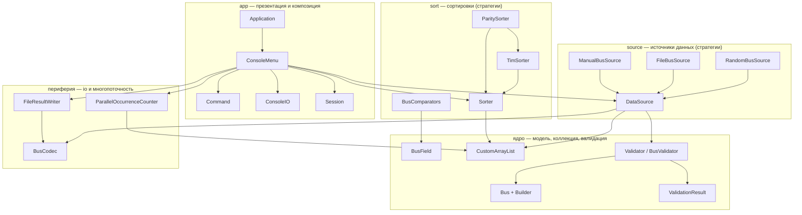

## 2. Классы: модель и кастомная коллекция

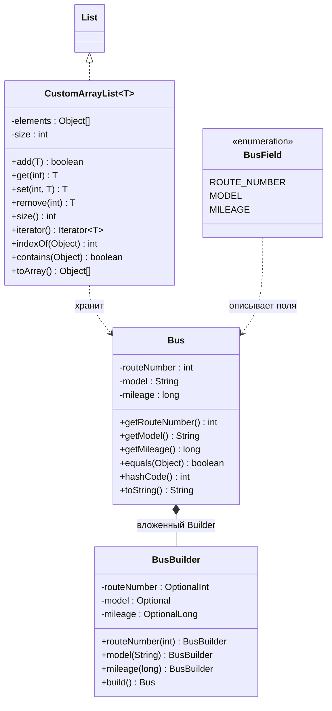

## 3. Классы: валидация и кодек

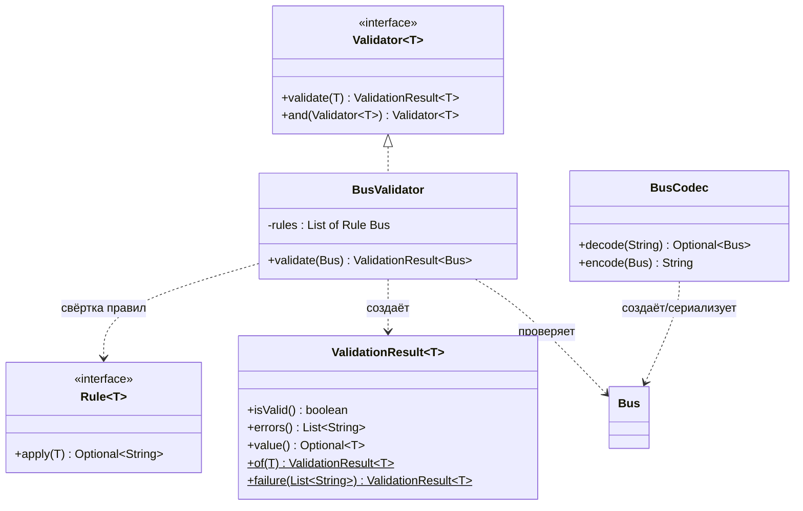

## 4. Классы: слой сортировки

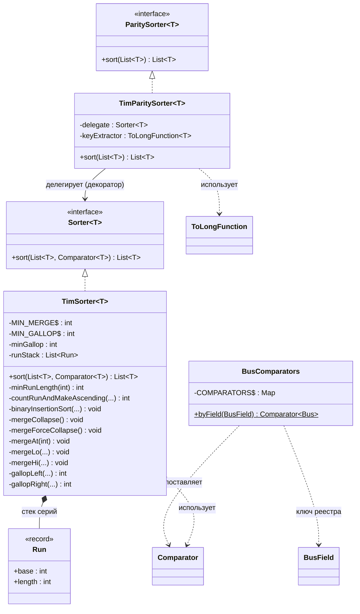

## 5. Классы: источники, io, многопоточность, меню

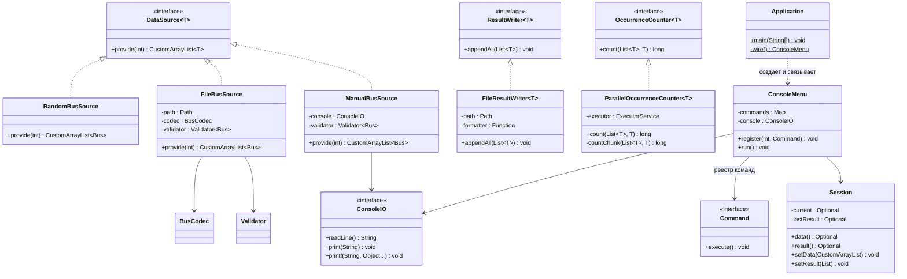

## 6. Диаграмма последовательности: основной сценарий сессии

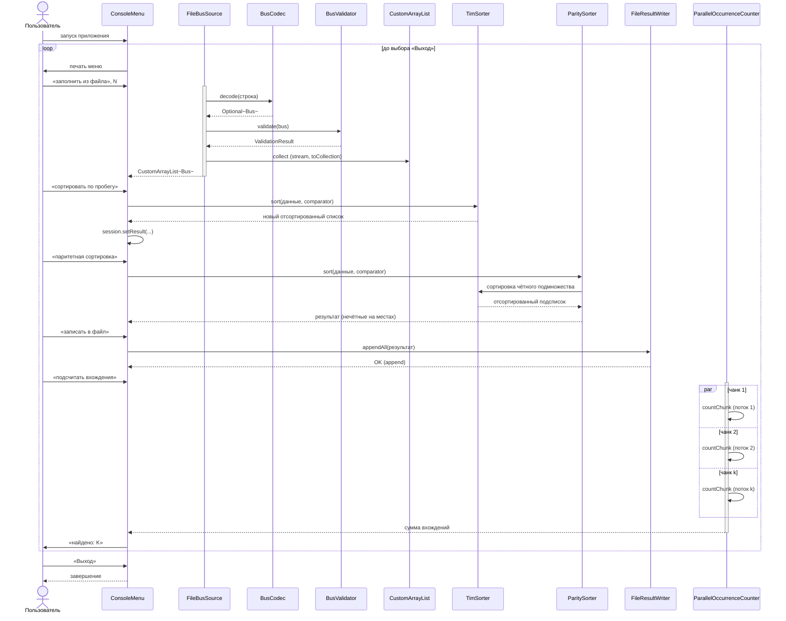

## 7. Диаграмма состояний: цикл приложения

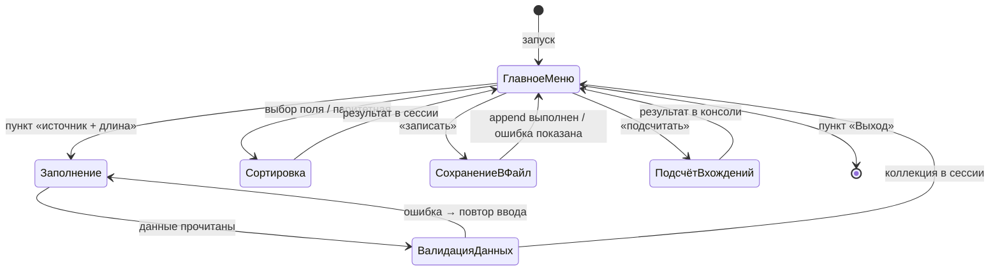

## 8. Activity-диаграмма: TimSorter.sort

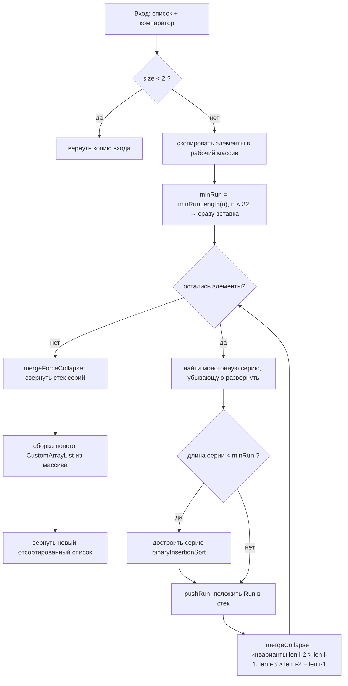

## 9. Activity-диаграмма: ParitySorter.sort (задание 1)

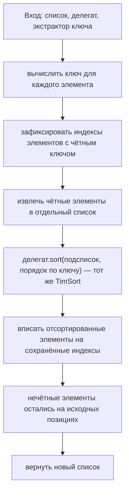