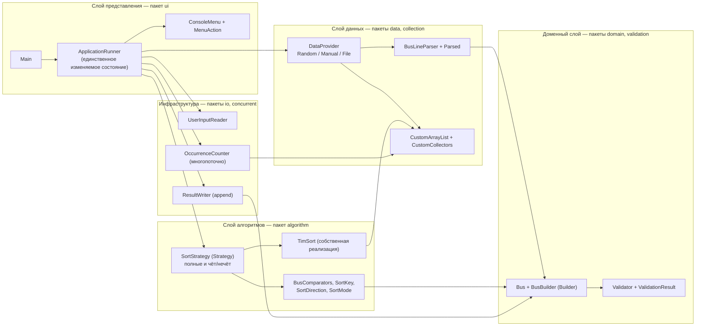
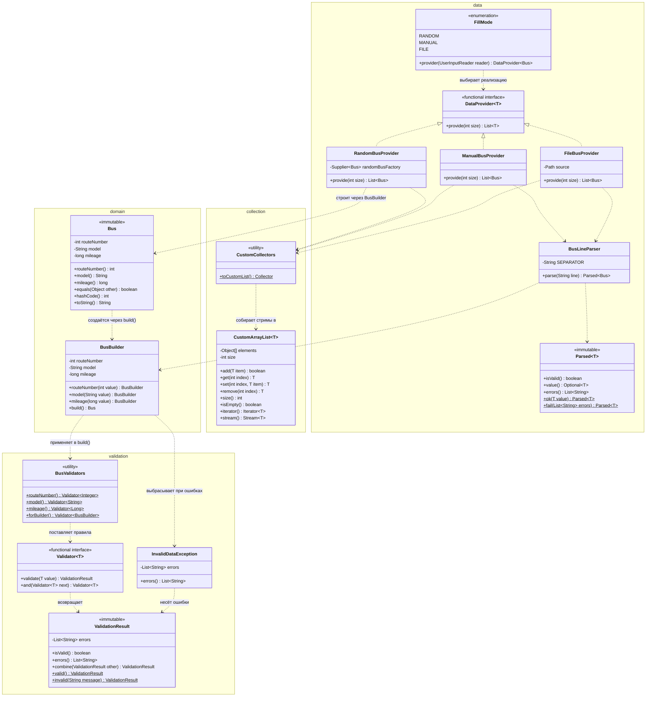
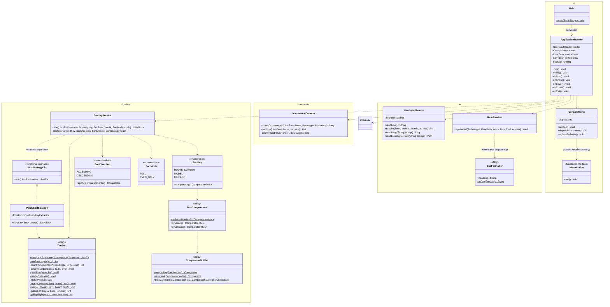
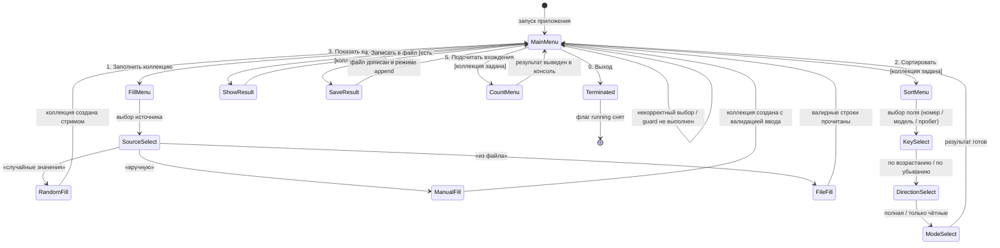
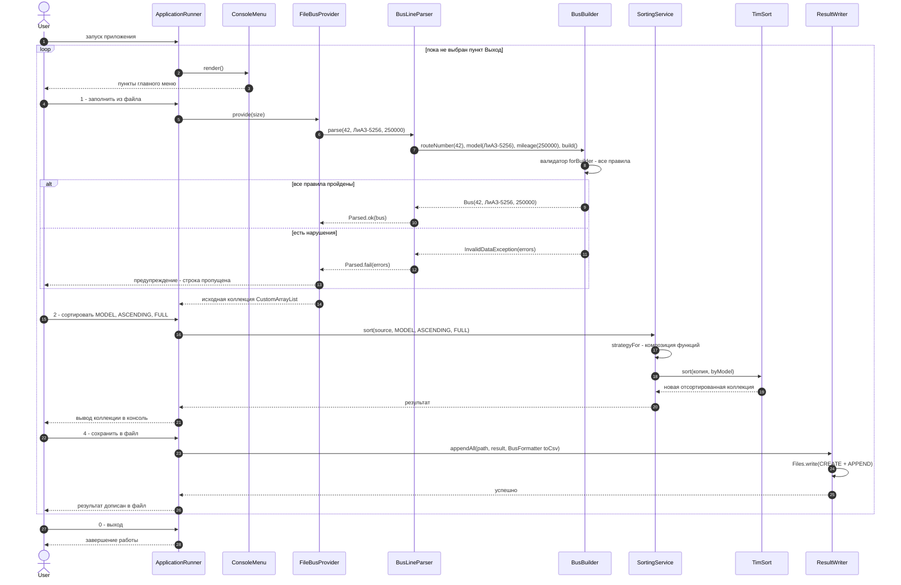
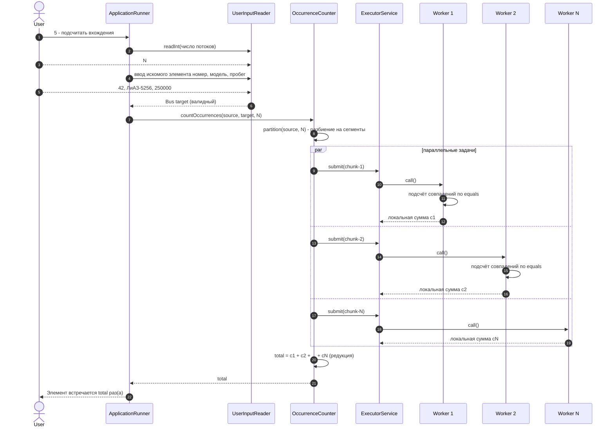
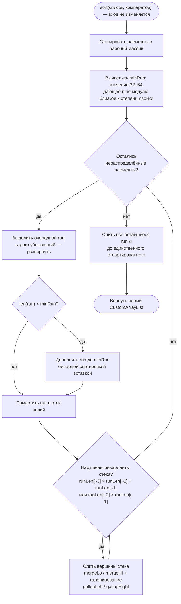
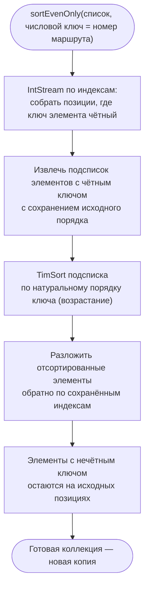

# Архитектура консольного приложения "Sorter"

## Часть 1. Текстовое описание архитектуры

### 1.1. Назначение и общий замысел

Приложение представляет собой консольную утилиту на Java (17+), работающую в бесконечном цикле и предоставляющую пользователю возможность сформировать коллекцию объектов класса **Автобус** (`Bus` с полями «номер маршрута», «модель», «пробег»), отсортировать её собственной реализацией алгоритма **Timsort** по любому из трёх полей в обоих направлениях, а также воспользоваться дополнительными режимами: сортировкой «только чётных» элементов, дозаписью результатов в файл, многопоточным подсчётом вхождений элемента. Выход из цикла возможен исключительно через явный выбор соответствующего пункта меню. Все готовые реализации сортировки, поиска и паттернов не используются — Timsort, компараторы-комбинаторы, Builder, Стратегия и кастомная коллекция реализованы вручную.

Замысел архитектуры — гибрид объектно-ориентированной структуры пакетов и функционального стиля там, где он даёт выгоду: доменные объекты неизменяемы, все точки расширения выражены функциональными интерфейсами, конфигурация поведения собирается композицией функций и лямбда-выражений, а изменяемое состояние приложения сознательно локализовано в одном классе. Это и есть «максимально функциональный стиль в разумных пределах»: чистые функции в ядре (валидация, сортировка, парсинг), лямбды и стримы на границах, но при этом понятная пакетная структура и явные паттерны Builder и Strategy, требуемые заданием.

### 1.2. Слои и пакеты

Система разделена на шесть пакетов, отражающих слои ответственности. Корневой пакет по конвенции Java именуется по домену организации, например `ru.university.bussort`, внутри которого располагаются подпакеты `domain`, `validation`, `collection`, `data`, `algorithm`, `io`, `concurrent` и `ui`. Зависимости направлены строго сверху вниз: слой представления (`ui`) знает обо всех слоях, слой алгоритмов и данных зависит только от домена и валидации, а домен не зависит ни от кого. Инфраструктурный пакет `io` (чтение консоли и запись файлов) и пакет `concurrent` используются только слоем представления. Такая направленность исключает циклические зависимости и позволяет тестировать ядро (валидацию, Timsort, парсер) без консоли и файловой системы.

### 1.3. Доменная модель и паттерн Builder

Класс `Bus` спроектирован как неизменяемый value-объект: он объявлен `final`, все три поля (`routeNumber: int`, `model: String`, `mileage: long`) помечены `private final`, доступ осуществляется методами-аксессорами без префикса `get` (в стиле `record`-подобных проекций), сеттеры отсутствуют в принципе, а `equals`, `hashCode` и `toString` реализованы по контракту — `equals` понадобится многопоточному подсчёту вхождений. Создание объекта возможно только через вложенный статический класс `BusBuilder`, реализующий паттерн Builder с fluent-интерфейсом: каждый сеттер возвращает сам билдер, а метод `build()` сначала прогоняет накопленное состояние через скомпонованный валидатор и лишь затем конструирует `Bus`. Таким образом, в системе физически не может существовать невалидного экземпляра `Bus` — инварианты гарантируются конструкцией, что соответствует функциональному принципу «делать некорректные состояния невыразимыми».

### 1.4. Функциональная валидация

Валидация построена как композиция чистых функций. Функциональный интерфейс `Validator<T>` имеет единственный метод `validate(T value): ValidationResult` и метод-комбинатор `and`, позволяющий собирать цепочки правил. `ValidationResult` — неизменяемый агрегат ошибок с операцией `combine`, что даёт классическую аппликативную валидацию: пользователь видит сразу все ошибки, а не первую попавшуюся. Фабрика `BusValidators` поставляет правила для каждого поля и композитный валидатор билдера. Для полей установлены следующие ограничения:

- номер маршрута — целое число в диапазоне от 1 до 999;
- модель — непустая строка длиной до 40 символов, допускающая буквы, цифры, пробелы, дефисы и точки;
- пробег — неотрицательное целое число, не превышающее 5 000 000 км.

Если `build()` обнаруживает нарушения, выбрасывается исключение `InvalidDataException`, несущее полный список сообщений; это единственная «нечистая» точка валидации, отделяющая функциональное ядро от императивной обвязки.

### 1.5. Заполнение коллекции: провайдеры, стримы, кастомная коллекция

Заполнение реализовано как семейство поставщиков данных за функциональным интерфейсом `DataProvider<T>` с методом `provide(int size)`. Перечисление `FillMode` связывает пункт меню с конкретным поставщиком, возвращая его из метода `provider()` — по сути это фабрика, записанная в функциональном стиле. `RandomBusProvider` генерирует коллекцию целиком стримом: `Stream.generate(randomBusFactory).limit(size).collect(CustomCollectors.toCustomList())`, где фабрика — `Supplier<Bus>`, выдающий только валидные значения. `ManualBusProvider` в цикле по количеству элементов читает строки формата «номер;модель;пробег», прогоняет их через `BusLineParser` и в случае ошибок повторяет ввод, показывая пользователю все сообщения валидатора. `FileBusProvider` читает файл стримом `Files.lines`, отображает каждую строку парсером в `Parsed<Bus>` (функциональный аналог `Either`), валидные записи собирает в коллекцию, а невалидные пропускает с предупреждением в консоль; если валидных записей нет, выбрасывается исключение. Длина, указываемая пользователем, применяется к случайному и ручному режимам, а в файловом режиме определяется фактическим числом валидных строк.

Ключевой момент дополнительного задания 3*: коллекция не является `ArrayList`. Пакет `collection` содержит `CustomArrayList<T>` — собственную реализацию интерфейса `List<T>` на динамически растущем массиве с самописным итератором (без наследования `AbstractList`), а также утилиту `CustomCollectors.toCustomList()`, возвращающую `Collector`, собранный из ссылок на методы `CustomArrayList::new` и `add`. Именно в эту коллекцию собираются все стримы приложения, включая внутреннюю работу сортировщика.

### 1.6. Timsort и паттерн Стратегия

Ядро пакета `algorithm` — класс `TimSort` с единственной публичной чистой функцией `sort(List<T> source, Comparator<T> order): List<T>`: она копирует вход в рабочий массив, не мутирует оригинал и возвращает новый `CustomArrayList`. Реализация воспроизводит канонический алгоритм: вычисление `minRun` (значение из диапазона 32–64, приводящее длину к степени двойки с точностью до остатка), выделение естественных возрастающих серий с разворотом строго убывающих, достройку коротких серий бинарной сортировкой вставкой, стек серий с проверкой инвариантов `runLen[i-3] > runLen[i-2] + runLen[i-1]` и `runLen[i-2] > runLen[i-1]`, а также слияние `mergeLo`/`mergeHi` с режимом галопирования (`gallopLeft`, `gallopRight`) и временным буфером меньшей из серий. Стабильность гарантируется выбором стороны слияния.

Паттерн Стратегия выражен функционально: `SortStrategy<T>` — интерфейс с методом `sort(List<T>)`, а его реализации не образуют иерархии классов, а собираются фабрично. Полная сортировка по полю — это лямбда, частично применённая к `TimSort::sort` с нужным компаратором; компараторы, в свою очередь, строятся утилитой `ComparatorBuilder` (собственные комбинаторы `comparing`, `thenComparing`, `reversed`), а `BusComparators` даёт три базовых компаратора по всем полям. Перечисления `SortKey` (три поля), `SortDirection` (по возрастанию/убыванию) и `SortMode` (полная сортировка / только чётные) формируют декларативное описание запроса, а класс `SortingService` выступает контекстом стратегии: он единственным выражением собирает из выбранных параметров конкретную функцию сортировки и применяет её к коллекции. Так паттерн Стратегия соблюдён буквально (контекст, интерфейс, семейство взаимозаменяемых алгоритмов), но реализован через композицию функций, а не через наследование.

### 1.7. Режим «только чётные» (дополнительное задание 1)

Отдельная реализация `ParitySortStrategy` решает задачу частичной сортировки по числовому полю «номер маршрута». Алгоритм работает в три чистых шага: сначала через `IntStream` по индексам собираются позиции элементов, у которых ключ чётный; затем соответствующие элементы извлекаются в подсписок с сохранением исходного порядка и сортируются Timsort по натуральному порядку ключа; наконец, отсортированные значения раскладываются обратно по сохранённым индексам. Элементы с нечётным номером маршрута при этом гарантированно остаются на своих исходных позициях. Стратегия переиспользует тот же движок Timsort, что и полные сортировки, что и требуется формулировкой «эти же алгоритмы».

### 1.8. Запись результатов в файл (дополнительное задание 2)

Класс `ResultWriter` инкапсулирует дозапись: метод `appendAll(Path, List<Bus>, Function<Bus, String>)` открывает файл с флагами `CREATE` и `APPEND`, при создании файла пишет строку заголовка, после чего отображает каждый элемент переданным форматтером. Форматтер — это `BusFormatter.toCsv`, передаваемый в `ResultWriter` ссылкой на метод, что сохраняет функциональный стиль: модуль записи ничего не знает о домене, а домен ничего не знает о файлах. Повторные сохранения дополняют файл, а не перезаписывают его.

### 1.9. Многопоточный подсчёт вхождений (дополнительное задание 4)

`OccurrenceCounter` реализует метод `countOccurrences(List<Bus> items, Bus target, int threads)`. Коллекция разбивается на `threads` непрерывных сегментов, для каждого создаётся `Callable<Long>`, подсчитывающий локальное число совпадений по `equals`; задачи отправляются в фиксированный пул через `invokeAll`, после чего частичные суммы сворачиваются редукцией `Long::sum`. Пул создаётся на время вызова и закрывается конструкцией try-with-resources, поэтому операция не оставляет «глобального» изменяемого состояния. Результат выводится в консоль вызывающим кодом.

### 1.10. Консольный интерфейс и главный цикл

Слой `ui` состоит из точки входа `Main`, исполнителя `ApplicationRunner` и меню `ConsoleMenu`. Меню построено декларативно: пункты хранятся в отображении «номер → `MenuAction`», где `MenuAction` — функциональный интерфейс, а сами пункты — лямбды, замыкающиеся на состояние исполнителя. `ApplicationRunner` — единственный владелец изменяемого состояния приложения (исходная коллекция, последний отсортированный результат, флаг `running`); он исполняет цикл `while (running)`, в котором рендерит меню, читает выбор и диспетчеризует действие. Выход из цикла возможен только тогда, когда лямбда пункта «Выход» снимает флаг `running`. Операции сортировки, показа, сохранения и подсчёта защищены guard-условием: при отсутствии заполненной коллекции пользователь получает предупреждение и возвращается в меню. Обёртка `UserInputReader` отвечает за валидированный ввод целых чисел в диапазоне, длин и путей к существующим файлам, конвертируя ошибки формата в понятные сообщения без падения цикла. Ошибки ввода-вывода файлов перехватываются на уровне исполнителя и также не прерывают работу программы.

### 1.11. Организация репозитория и стиль

Репозиторий ведётся на GitHub/GitLab с ветвлением по числу участников; каждая ветка соответствует зоне ответственности и вливается в `main` через merge после ревью. Ожидаемый набор веток:

- `feature/domain-model` — `Bus`, `BusBuilder`, валидация;
- `feature/timsort-engine` — движок Timsort и компараторы;
- `feature/data-providers` — провайдеры, парсер, `CustomArrayList`;
- `feature/console-ui` — меню, цикл, читатель ввода;
- `feature/file-export` — дозапись результатов в файл;
- `feature/concurrency` — многопоточный подсчёт вхождений.

Стиль кода следует конвенциям Java: имена пакетов в нижнем регистре, классы в `UpperCamelCase`, методы и поля в `lowerCamelCase`, константы в `UPPER_SNAKE_CASE`, отступ в четыре пробела, Javadoc на публичных API, объявление неизменяемых ссылок через `final` везде, где это осмысленно.

---

## Часть 2. UML-диаграммы

### 2.1. Обзорная диаграмма слоёв (компонентное представление)

### 2.2. Диаграмма классов — домен, валидация, данные, коллекция

### 2.3. Диаграмма классов — алгоритмы, инфраструктура, интерфейс

### 2.4. Диаграмма состояний — жизненный цикл приложения

### 2.5. Диаграмма последовательностей — основной сценарий

### 2.6. Диаграмма последовательностей — многопоточный подсчёт вхождений

### 2.7. Диаграмма деятельности — алгоритм Timsort

### 2.8. Диаграмма деятельности — стратегия «чётные по натуральному порядку»

---

Описанная архитектура закрывает все пункты задания: собственный Timsort с компараторами по трём полям, паттерны Builder и Strategy, три способа валидируемого заполнения (стримами, в кастомную коллекцию), частичная сортировка чётных, дозапись результатов в файл и многопоточный подсчёт вхождений — при этом функциональный стиль проведён последовательно во всех чистых слоях и сознательно ограничен там, где задание требует императивных конструкций (главный цикл, консольный ввод-вывод, пул потоков).