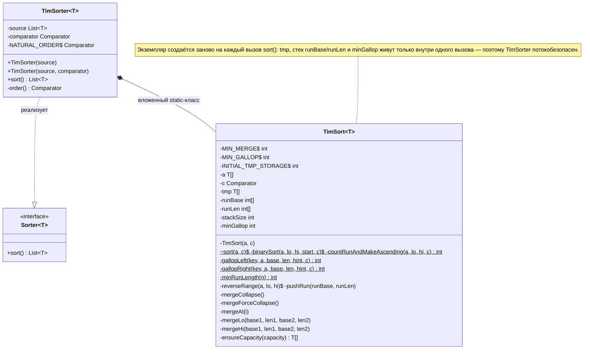
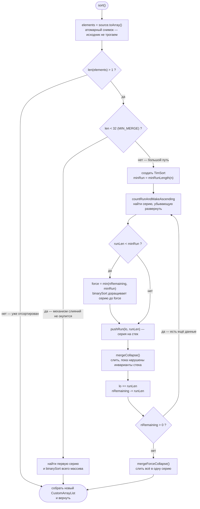

# TimSort: подробный разбор для начинающих

## 1. Откуда взялся этот алгоритм

**TimSort** придумал Тим Питерс в 2002 году для Python (вошёл в версию 2.3). Идея простая, но гениальная: реальные данные редко бывают полностью случайными. Логи за день почти отсортированы по времени, таблица отсортирована по одному столбцу пока вы сортируете по другому, файл частично упорядочен прошлой сортировкой. TimSort **находит уже готовый порядок в данных и использует его**, вместо того чтобы ломать всё и строить заново.

Где он работает сегодня:

| Среда | Где именно |
|---|---|
| Python | `sorted()` и `list.sort()` |
| Java (JDK 7+) | `Arrays.sort(Object[])`, `Collections.sort()` |
| JavaScript в Chrome/Node (V8) | `Array.prototype.sort()` (стабильный, с ES2019) |
| Android | наследует реализацию Java |

Почему Java сортирует примитивы (`int[]`) иначе — двойной быстрой сортировкой? Потому что примитивам **не нужна стабильность**: все пятёрки неотличимы друг от друга, их можно безнаказанно переставлять. А у объектов есть идентичность, и равные объекты нельзя перемешивать — для них нужен TimSort.


## 2. Глоссарий

- **Серия (run)** — идущий подряд кусок массива, который *уже* упорядочен.
- **Стабильность** — свойство: элементы, которые компаратор считает равными, сохраняют взаимный порядок.
- **Инвариант** — условие, которое код обязан поддерживать постоянно.
- **Снимок (snapshot)** — независимая копия данных на момент вызова; исходник не трогаем.
- **Буфер `tmp`** — «черновик», куда временно копируется часть данных при слиянии.
- **Галоп** — экспоненциальный поиск (прыжки 1, 3, 7, 15, 31…), ускорение для «несмешанных» данных.

## 3. Карта кода

Код состоит из двух классов:



`TimSorter` — тонкая обёртка: хранит ссылку на список и компаратор, сама логика — во вложенном классе, который живёт только внутри одного вызова `sort()` (это важно для потоков, см. раздел 14).

Константы:

| Константа | Значение | Смысл |
|---|---|---|
| `MIN_MERGE` | 32 | ниже этого размера слияния не используются вовсе |
| `MIN_GALLOP` | 7 | столько побед подряд включает галоп |
| `INITIAL_TMP_STORAGE` | 256 | стартовый размер буфера (растёт по надобности) |
| `stackLen` | 5 / 10 / 24 / 40 | размер стека серий — зависит от длины массива |

## 4. Описание алгоритма

TimSort получает на вход список и правило сравнения элементов, а возвращает новый, упорядоченный список. Исходные данные при этом не изменяются: алгоритм работает с копией, снятой снимком в самом начале, — поэтому и результат всегда консистентен, и источник остаётся нетронутым.

Работа начинается с двух простых проверок. Если элементов меньше двух, сортировать нечего — массив из нуля или одного элемента упорядочен по определению. Иначе если элементов меньше тридцати двух, алгоритм вовсе не строит механизм серий и слияний: на таком объёме он не окупается. Вместо этого фиксируется первый упорядоченный отрезок (даже если он длиной в один элемент), и весь массив доводится до порядка бинарными вставками — тем же способом, каким игрок раскладывает карты по местам, только позицию каждой «карты» поиск находит делением диапазона пополам.

Для больших массивов используется собственно TimSort. Сначала вычисляется целевая длина серии — число от 16 до 32, подобранное так, чтобы количество серий оказалось близким к степени двойки: это сохранит финальным слияниям сбалансированность. Затем алгоритм движется по данным слева направо. В каждой точке он выделяет серию — идущий подряд уже упорядоченный отрезок: возрастающий (равные соседи не мешают) используется как есть, а строго убывающий разворачивается на месте. Строгая монотонность отрезка здесь имеет принципиальное значение: если бы развернули серию, заканчивающуюся равными элементами, они поменялись бы местами, а стабильная сортировка не имеет права менять взаимный порядок равных. Короткая серия при этом доращивается бинарными вставками до целевой длины — либо до конца данных, если осталось меньше. Так в дальнейшую работу попадают только серии приемлемой длины.

Готовая серия не сливается с соседями немедленно — она кладётся на стек, и сразу после этого проверяется баланс. Правило такое: глядя сверху вниз, длины серий должны расти не медленнее чисел Фибоначчи — третья сверху серия длиннее двух верхних, взятых вместе, а предпоследняя длиннее последней (почему это должно быть так, разберём в следующем разделе). Пока правило нарушено, верхние серии попарно сливаются.

Когда вход исчерпан, на стеке остаётся несколько серий. Финальным проходом они сливаются в одну, которая и представляет собой полностью отсортированный массив. Остаётся собрать её элементы в новый список и вернуть вызывающей стороне.

```
АЛГОРИТМ TimSort
ВХОД:  список source и правило сравнения элементов
ВЫХОД: новый отсортированный список; исходник не изменяется

1. СНЯТЬ КОПИЮ данных.

2. ЕСЛИ элементов меньше двух — данные уже отсортированы,
   перейти к шагу 7.

3. ЕСЛИ элементов меньше 32 — механизм серий и слияний не окупится:
   3.1. найти первую упорядоченную серию,
   3.2. отсортировать весь массив бинарными вставками,
   3.3. перейти к шагу 7.

4. ПОДГОТОВИТЬ большой путь:
   вычислить minRun — целевую длину серии (16–32),
   подобранную так, чтобы число серий было близко к степени двойки.

5. ПОКА остались несортированные элементы:
   5.1. НАЙТИ СЕРИЮ — пройти вперёд, пока элементы идут по порядку;
        строго убывающую серию развернуть на месте.
   5.2. ЕСЛИ серия короче minRun — ДОРАСТИТЬ её до minRun
        (или до конца данных) бинарными вставками.
   5.3. ПОЛОЖИТЬ серию на стек — запомнить её начало и длину.
   5.4. СБАЛАНСИРОВАТЬ стек — пока нарушается правило
        «длины серий сверху вниз растут не медленнее чисел Фибоначчи»,
        сливать верхние серии попарно.
   5.5. Сдвинуть позицию вперёд на длину серии; повторить.

6. СЛИТЬ всё, что осталось на стеке, в одну серию — вход исчерпан.

7. СОБРАТЬ результат в новый список и вернуть его.
```



## 5. Инварианты стека

Как уже было сказано, в TimSort сортируемый массив сначала разрезается на естественные серии — максимальные неубывающие или невозрастающие участки, которые уже не нужно переупорядочивать внутри. Невозрастающие серии разворачиваются, после чего серии по мере просмотра массива складываются в стек и периодически сливаются. Чтобы этот процесс не выродился в череду мелких слияний, TimSort поддерживает специальный инвариант на длины серий в стеке. Если смотреть на стек сверху вниз, длины должны расти не медленнее чисел Фибоначчи.

Будем считать, что верхняя серия стека — это последняя добавленная серия. Обозначим её длину через $a_1$, длину следующей серии под ней — через $a_2$, длину третьей сверху — через $a_3$, и вообще пусть $a_i$ будет длиной $i$-й сверху серии. Тогда инвариант TimSort можно записать так: $a_2 > a_1$, $a_3 > a_2 + a_1$, и для всякого $i \ge 3$ выполнено $a_i > a_{i-1} + a_{i-2}$. Иными словами, предпоследняя серия длиннее последней, третья сверху длиннее двух верхних, взятых вместе, четвёртая сверху длиннее суммы третьей и второй, и так далее. Именно это означает, что при движении вниз по стеку длины серий растут не медленнее чисел Фибоначчи.

## 6. Амортизационный анализ стоимости слияний в TimSort: подробный разбор

### Модель стоимости одного слияния

Начнём с того, что стоимость слияния двух серий длин $a$ и $b$ составляет $\Theta(a + b)$, и обоснуем это. Стандартная процедура слияния устроена как цикл: на каждой итерации сравниваются головные элементы двух серий, меньший из них копируется в выходной массив, и соответствующий указатель сдвигается. Цикл завершается, когда одна из серий исчерпана, после чего остаток другой копируется целиком. Каждая итерация выполняет ровно одно сравнение и одно копирование, а число итераций не превосходит 

$$a + b - 1,$$

поскольку каждая итерация продвигает хотя бы один указатель, а суммарный путь двух указателей равен 

$$a + b.$$ 

Каждый элемент из обеих серий ровно один раз попадает в выходной массив — ничего не теряется и ничего не дублируется. Поэтому копирований всегда ровно

$$a + b,$$

независимо от того, как чередуются элементы.

Теперь почему число копирований — это то же самое, что суммарный путь указателей. Слияние держит два указателя: один на текущий элемент первой серии, другой — на текущий элемент второй. Указатель сдвигается ровно тогда, когда его элемент скопирован: скопировали элемент первой серии — сдвинули первый указатель, скопировали элемент второй — сдвинули второй. Значит, каждое копирование соответствует ровно одному шагу одного из указателей, и наоборот.

В сумме первый указатель пройдёт свою серию целиком — $a$ шагов, второй пройдёт свою — $b$ шагов. Суммарный путь равен $a + b$, и это в точности число копирований, потому что «шаг указателя» и «копирование элемента» — два названия одного и того же события.

Следовательно, стоимость слияния линейна по сумме длин, причём это верно и в худшем случае; режим галопа в TimSort улучшает лишь константу на благоприятных данных, но не меняет асимптотической модели.

### От стоимости слияний к участиям элементов

Ключевой приём амортизационного анализа здесь — двойной счёт. С одной стороны, суммарная стоимость всех слияний есть сумма по всем слияниям величин $a + b$. С другой стороны, величина $a + b$ для конкретного слияния — это в точности число элементов, которые в нём участвуют, то есть каждый элемент двух сливаемых серий «оплачивает» одну единицу работы (своё копирование и в среднем свою долю сравнений). 

Пусть за весь прогон алгоритма выполняются слияния $M_1, M_2, \ldots, M_t \in \mathcal{M}$, а массив состоит из элементов $e_1, \ldots, e_n \in \mathcal{E}$. Определим множество пар

$$
S = \{\, (e, M) \;:\; \text{элемент } e \text{ участвует в слиянии } M \,\},
$$

то есть все пары, в которых элемент входит в одну из двух сливаемых серий данного слияния.

Чтобы сделать рассуждение строгим, введём функцию-индикатор участия:

$$
\mathbb{1}[e, M] = \begin{cases} 1, & \text{если } e \text{ участвует в } M, \\ 0 & \text{иначе}. \end{cases}
$$

Тогда мощность множества $S$ записывается как двойная сумма, которую можно группировать двумя способами:

$$
|S| = \sum_{M \in \mathcal{M}} \sum_{e \in \mathcal{E}} \mathbb{1}[e, M] = \sum_{e \in \mathcal{E}} \sum_{M \in \mathcal{M}} \mathbb{1}[e, M].
$$

Смысл перестановки в том, что в левой записи мы сначала фиксируем слияние и перебираем все его элементы, а в правой — сначала фиксируем элемент и перебираем все слияния с его участием.

Теперь вычислим внутренние суммы в обеих группировках. Для фиксированного слияния $M$, сливающего серии длин $a_M$ и $b_M$, сумма 

$$\sum_e \mathbb{1}[e, M]\quad - $$ 

это просто число участвующих в нём элементов, то есть ровно 

$$a_M + b_M:$$ 

каждый элемент обеих серий участвует, остальные — нет. Значит, левая группировка даёт

$$
|S| = \sum_{M \in \mathcal{M}} (a_M + b_M).
$$

С другой стороны, для фиксированного элемента $e$ сумма 

$$\sum_M \mathbb{1}[e, M]\quad -$$

это число слияний, в которых он участвовал за весь прогон. Значит, правая группировка даёт сумму количеств слияний с участием элемента $e$ по всем элементам $\mathcal{E}$:

$$
|S| = \sum_{e \in \mathcal{E}} (\text{число слияний с участием } e).
$$

Таким образом,

$$
|S| = \sum_{M \in \mathcal{M}} (a_M + b_M) = \sum_{e \in \mathcal{E}} (\text{число слияний с участием } e). \tag{1}
$$

Таким образом, обе суммы считают одну и ту же величину — общее число пар «элемент, слияние с его участием» — но группируют слагаемые по-разному: первая по слияниям, вторая по элементам. Равенство таких сумм есть не что иное, как перестановка порядка суммирования в конечной двойной сумме. Это наблюдение *переводит задачу оценки стоимости в задачу оценки числа участий в слияниях одного элемента*: если каждый из $n$ элементов участвует не более чем в $T$ слияниях, то суммарная стоимость не превосходит 

$$n \cdot T$$.

### Дерево слияний и формула стоимости через глубины листьев

Проследим судьбу произвольной исходной серии $A_i$ в процессе работы алгоритма. Слияние никогда не дробит серию: операция слияния берёт две серии *целиком* и порождает одну новую серию, также рассматриваемую далее как неделимое целое. Формально это доказывается индукцией по числу слияний: вначале каждый элемент принадлежит ровно одной исходной серии; если слияние объединяет серии $A$ и $B$, то все элементы обеих оказываются в новой серии и далее участвуют в слияниях только вместе, поскольку новая серия тоже сливается только целиком.

Поэтому для любых двух элементов $e, e'$ из одной исходной серии $A_i$ множества слияний, в которых они участвуют, совпадают. В самом деле, на каждом шаге $e$ и $e'$ лежат в одной текущей серии, а значит, либо оба участвуют в очередном слиянии, либо оба не участвуют. Поэтому *число участий — это свойство серии, а не отдельного элемента*.

Удобный способ визуализировать процесс — дерево слияний. Его листья — исходные серии длин $\ell_1, \ldots, \ell_m$, каждая внутренняя вершина — одно слияние, а корень — финальный отсортированный массив. Пусть $d_i$ — глубина листа $i$, то есть число слияний на пути от него к корню, то есть элементы серии $i$ участвуют ровно в $d_i$ слияниях: по одному на каждом уровне этого пути.

Пусть множество всех элементов разбито на серии $A_1, \ldots, A_m$, внутри серии $A_i$ каждый из $\ell_i$ элементов участвует ровно в $d_i$ слияниях. Поэтому

$$
\sum_{e \in \mathcal{E}} (\text{число слияний с участием } e) = \sum_{i=1}^{m} \sum_{e \in A_i} d_i = \sum_{i=1}^{m} \ell_i \, d_i,
$$

где первое равенство — разбиение суммы по непересекающимся группам, а второе — тот факт, что сумма одинаковых слагаемых $d_i$ по $\ell_i$ элементам равна произведению $\ell_i \cdot d_i$.

Поэтому из формулы (1) следует равенство

$$
|S| = \sum_{i=1}^{m} \ell_i \, d_i.
$$

Эта формула — центральный инструмент анализа: она показывает, что стоимость определяется не только длинами серий, но и формой дерева слияний, то есть порядком, в котором TimSort их сливает. Инвариант стека существует именно для того, чтобы контролировать форму этого дерева.

### Вырожденный сценарий: линейная цепочка слияний

Рассмотрим теперь стратегию «каждую новую серию сливать с уже накопленной» и покажем, что она катастрофична. Пусть все $m$ серий имеют одинаковую длину $\ell$, так что $n = m\ell$. Первое слияние объединяет две серии и стоит $2\ell$, второе сливает накопленные $2\ell$ с новой серией и стоит $3\ell$, и так далее; $k$-е слияние стоит $(k+1)\ell$. Суммарная стоимость равна

$$
\ell \cdot (2 + 3 + \cdots + m) = \ell \left( \frac{m(m+1)}{2} - 1 \right) \approx \frac{n \, m}{2},
$$

В терминах дерева слияний это вырожденное дерево, в котором глубины листьев равны $$1, 2, \ldots, m-1, m-1$$, и формула $$\sum \ell_i d_i$$ даёт тот же результат.

Теперь вспомним, что в худшем случае число серий велико: если вход состоит из коротких серий минимальной длины, то $m = \Theta(n)$, и стоимость $n \cdot m / 2$ становится $\Theta(n^2)$. Сортировка слиянием при этом теряет своё главное достоинство — гарантию 

$$O(n \log n)\quad — $$

и вырождается до уровня квадратичных алгоритмов. Именно этот сценарий и должен исключать инвариант.

### Сбалансированное дерево как эталон

Противоположный полюс — полностью сбалансированное дерево, в котором сливаются серии попарно равной длины, как в классической рекурсивной сортировке слиянием. Там все глубины листьев равны примерно

$$\log_2 m,$$

и формула стоимости даёт

$$
\sum_{i=1}^{m} \ell_i d_i \approx \log_2 m \cdot \sum_{i=1}^{m} \ell_i = n \log_2 m \leq n \log_2 n.
$$

Заметим попутно, что стремление сливать серии сопоставимой длины имеет и более глубокое обоснование: задача минимизации величины $$\sum \ell_i d_i$$ по всем двоичным деревьям с заданными весами листьев — это в точности задача построения оптимального префиксного кода, решаемая алгоритмом Хаффмана, а сбалансированные деревья близки к оптимальным, когда веса сопоставимы. TimSort, разумеется, не строит дерево Хаффмана — он обязан сливать только соседние серии, чтобы сохранять устойчивость и локальность, — но инвариант заставляет его дерево быть «достаточно сбалансированным».

### Как инвариант Фибоначчи ограничивает глубины

Напомним инвариант: для трёх верхних серий стека $X, Y, Z$ (снизу вверх) выполнено $X > Y + Z$ и $Y > Z$, то есть длины серий в стеке снизу вверх удовлетворяют рекуррентному неравенству $L_i \geq L_{i-1} + L_{i-2}$. Это рекуррентное соотношение Фибоначчи, и из него следуют два нужных нам факта.

Первый факт — экспоненциальный рост: 

$$L_i \geq F_i = \Theta(\varphi^i),$$

где 

$$\varphi = \frac{1+\sqrt{5}}{2}\quad -$$

больший корень характеристического уравнения $$x^2 = x + 1$$. 

И поскольку 

$$\varphi^2 = \varphi + 1 > 2,$$

каждые два уровня вниз по стеку длина серии как минимум удваивается: 

$$L_{i+2} \geq L_{i+1} + L_i \geq 2 L_i.$$

Отсюда глубина стека есть $$O(\log_\varphi n)$$.

### Аргумент удвоения: сколько раз участвует один элемент

Теперь основное утверждение амортизационного анализа: каждый элемент участвует в $O(\log n)$ слияниях. Идея доказательства такова. Проследим за серией, содержащей фиксированный элемент $e$, и за тем, как растёт её длина от слияния к слиянию. Если серия элемента сливается с серией не меньшей длины, то её размер как минимум удваивается. Проблему представляют лишь «невыгодные» слияния, когда партнёр существенно короче. Ключевое наблюдение состоит в том, что инвариант не позволяет таким невыгодным слияниям повторяться подряд: если серия элемента только что слилась с соседней серией слишком малой длины, то в силу правила слияний (сливается меньшая из двух кандидаток, а нижележащие серии по инварианту экспоненциально длиннее) образовавшаяся серия либо немедленно вовлекается в следующее слияние с партнёром не меньше себя, либо при следующем своём участии встретит партнёра, длина которого не меньше её собственной. Типичная картина такова: серия длины $s$ поглощает серию длины $1$, становясь $s + 1$, но это нарушает инвариант относительно нижележащей серии длины не менее $s$, и следующее же слияние даёт серию длины не менее $2s + 1$. Таким образом, за каждые два участия длина серии элемента гарантированно вырастает не менее чем вдвое. Поскольку длина не может превзойти $n$, а удвоений от единицы до $n$ существует не более $\log_2 n$, элемент участвует не более чем в $2\log_2 n + O(1)$ слияниях.

Таким образом, инвариант Фибоначчи гарантирует, что дешёвые для элемента слияния неизбежно «оплачиваются» последующим сбалансированным слиянием, и потому темп роста серии элемента экспоненциален.

### Сборка результата

Подставляя оценку числа участий в формулу двойного счёта, получаем

$$
|S| = \sum_{e} (\text{число слияний с участием } e) \leq n \cdot (2\log_2 n + O(1)) = O(n \log n).
$$

## 7. Входная точка: `sort()`

```java
T[] elements = (T[]) source.toArray();
if (elements.length > 1) {
    TimSort.sort(elements, order());
}
// ... собрать результат в новый CustomArrayList
```

Здесь три решения, каждое — осознанное:

**Зачем снимок.** Алгоритм должен видеть консистентное состояние данных, а исходный список — не пострадать. `toArray()` у `CustomArrayList` делает одну атомарную копию под своим монитором. Дальше сортируется уже **наша частная копия** — её можно мутировать как угодно.

## 8. `binarySort` — бинарная вставка

Классическая сортировка вставками, как карточки в руке: берём элемент справа, находим ему место в уже отсортированной части, сдвигаем остальных, вставляем. Ускорение одно, но важное: место ищется *бинарным поиском* — за $\log_2{n}$ сравнений вместо $n$.

## 9. `countRunAndMakeAscending` — поиск серий

Функция смотрит на пару первых элементов и решает, какая серия перед ней:

- *Восходящая* — нестрого возрастающая (`a[i] <= a[i+1] <= ...`). Равные элементы серию не разрывают.
- *Нисходящая* — *строго* убывающая (`a[i] > a[i+1] > ...`). Найдя такую, функция разворачивает её на месте (`reverseRange`: два указателя с концов меняются местами и идут навстречу).

Почему нисходящая обязана быть строго убывающей? Если бы развернули `[9, 7, 7]` целиком (нестрого), получилось бы `[7, 7, 9]` — семёрки поменялись местами. Для чисел неважно, но если это записи «Иванов 17:00» и «Иванов 19:00» с равным ключом — порядок записей испорчен. Стабильность дороже лишней пары сравнений.

## 10. `minRunLength` — калибровка длины серий

Серии нужны **не слишком короткие и не слишком длинные**:

- короткие — их много, слияний много, накладные расходы растут;
- длинные — а их-то мы получаем доращиванием бинарной вставкой, которая квадратична: серия длины 64 требует до ~64·6 сравнений.

Эмпирический оптимум — *от 16 до 32*. Функция возвращает целевую длину так, чтобы число серий оказалось степенью двойки (или чуть меньше) — тогда финальные слияния сбалансированы, как в честном merge sort:

```java
int r = 0;
while (n >= MIN_MERGE) {
    r |= (n & 1);   // запомнить, «терялась» ли единица при делении
    n >>= 1;        // поделить на 2
}
return n + r;
```

Мы делим `n` на двойки, пока не останется число меньше 32; флаг `r` помечает, было ли где-то «нечётное деление с остатком». В конце остаток приплюсовывается — поэтому результат и попадает в диапазон 16–32.

## 11. Стек серий и `mergeCollapse`: баланс — это инвариант

Найденные серии складываются в стек (`pushRun` пишет начало и длину). Сливать их сразу нельзя: можно получить слияние очень большой серии с очень маленькой, где маленькая серия протаскивается через всю большую серию. Поэтому после каждого `push` выполняется `mergeCollapse`, который сливает серии, пока не восстановятся **два инварианта** (здесь `i` — вершина стека):

```
1. runLen[i-3] > runLen[i-2] + runLen[i-1]   третья сверху длиннее двух верхних ВМЕСТЕ
2. runLen[i-2] > runLen[i-1]                 предпоследняя длиннее последней
```

Следствие: длины растут от вершины вниз *не медленнее чисел Фибоначчи* (1, 1, 2, 3, 5, 8, 13…). Поэтому стек требуется маленький.

## 12. `mergeAt`

Перед слиянием алгоритм дважды спрашивает: «а точно ли тут есть работа?»

**Вопрос 1:** где первый элемент run2 должен стоять в run1 (`gallopRight`)? Всё, что *левее* этой позиции в run1, — уже на финальных местах.

**Вопрос 2:** где последний элемент run1 должен стоять в run2 (`gallopLeft`)? Всё, что *правее*, — тоже финально.

`gallopRight` считает элементы *не больше* ключа. `gallopLeft` считает элементы *строго меньше* ключа. В обоих случаях равные из более левой серии выигрывают позицию — это стабильность. Поменять функции местами — сортировка не сломается, но станет нестабильной.

Далее слитая серия записывается в слот `i`, длина = `len1 + len2`; если сливались вторая и третья сверху, верхняя «съезжает» вниз; `stackSize--`.

## 13. `mergeLo` / `mergeHi`: само слияние

После обрезки остаются две «серединки». Сливаем их, и первое решение — *что копировать в буфер*: только *короткую* серию (поэтому `tmp` никогда не нужен больше половины массива). Если короче левая — `mergeLo`, идём слева направо; короче правая — `mergeHi`, справа налево. Это зеркальные методы; разберём `mergeLo`.

*Почему первый шаг сделан вручную, до цикла?* Обрезка из `mergeAt` гарантирует: голова run2 меньше всего оставшегося run1 (а в `mergeHi` симметрично — хвост run1 больше всего) — это глобальный экстремум.

*Запись при этом никогда не обгоняет чтение.* С run1 в буфере мы пишем результат поверх старого места run1. Не страшно ли затереть? Нет: `dest` отстаёт от `cursor2` ровно на «сколько осталось нес_consumированного run1» — математически `dest − cursor2 = (взято из run1) − (вся исходная длина run1) ≤ 0`. Поэтому писать можно смело, дополнительная память не нужна.

```java
do {  // режим 1: по одному элементу
  ...берём меньшего из двух голов...
  count1 / count2 — серия побед подряд (у проигравшего счёт сбрасывается)
} while ((count1 | count2) < minGallop);

do {  // режим 2: галоп
  ...находим и копируем целые блоки...
} while (count1 >= MIN_GALLOP | count2 >= MIN_GALLOP);
```

Обычное слияние сравнивает по паре за раз. Как только одна серия побеждает `minGallop` раз подряд — данные «несмешанные», и включается галоп.

Идиома `(count1 | count2) < minGallop`: проигравший в каждом шаге обнулен, поэтому побитовое ИЛИ двух счётчиков равно текущей серии побед.

`mergeHi` — то же самое зеркально: run2 в буфере, идём справа налево, берём *большего* из двух хвостов, вырожденные случаи на `len2 == 1` (одиночный минимум run2 встаёт *перед* остатками run1) и `len2 == 0`.

## 14. Галоп: `gallopLeft` и `gallopRight`

*Проблема.* Сливаем `[1, 2, 3, ..., 1000]` с `[500000]`. Обычное слияние сделает ~999 сравнений для вывода, очевидного с первого взгляда.

*Решение — экспоненциальный поиск.* Вместо шага на 1 — прыжки на 1, 3, 7, 15, 31, 63, 127… (каждый следующий = удвоить + 1). Прыгаем, пока не *перескочим* нужное место, затем бинарным поиском уточняем позицию внутри найденного «коридора». Итог: O(log k) сравнений вместо O(k), где k — длина блока. Найденный блок копируется одним `arraycopy`.

Две разновидности галопа различаются только отношением к равным. Для `a = [1, 3, 3, 3, 5]`, `key = 3`:

```
gallopLeft  -> 1   (один элемент строго меньше — самая ЛЕВАЯ позиция вставки)
gallopRight -> 4   (четыре элемента ≤ — самая ПРАВАЯ позиция вставки)
```

Именно выбором разновидности вызовы в `mergeAt` и в слияниях сохраняют стабильность: «включить равных в блок левой серии» или «исключить равных из блока правой».

*Параметр `hint`* — подсказка, индекс, с которого начинать (то начало, то конец диапазона — где ответ вероятнее). Первое же сравнение с `a[base+hint]` решает, галопировать вправо или влево, так что плохая подсказка стоит недорого.

*Параметр `base`* — смещение начала диапазона внутри массива. Благодаря нему одна и та же функция работает и с основным массивом `a`, и с буфером `tmp`.

Виртуальный a[-1]: если ключ меньше всех элементов, левый галоп исчерпывает диапазон, и скобка поиска *концептуально* начинается с индекса −1 — «как будто» перед массивом стоит элемент $-\infty$. 

Здесь же — защита от переполнения: `ofs = (ofs << 1) + 1` на ~31-й итерации переливается через `Integer.MAX_VALUE` и становится отрицательным; проверка `if (ofs <= 0) ofs = maxOfs` подрезает прыжок к границе диапазона.

*Адаптация порога `minGallop`.* Размер поля стартует с 7. Внутри галоп-режима каждая итерация делает `minGallop--`: пока галоп окупается, порог падает к 1 — входить в галоп всё легче. Как только блоки стали меньше 7 — возврат в пошаговый режим. После слияния значение записывается обратно (`Math.max(1, minGallop)`) и живёт до конца `sort()`: алгоритм *подстраивается под «кучковатость» данных*. Обратите внимание на тонкость: в порог **входа** в галоп используется адаптивное поле, а в условии **продолжения** — константа `MIN_GALLOP`.

## 12. Память: `tmp` и `ensureCapacity`

Буфер стартует с `min(длина/2, 256)` элементов и растёт по мере надобности — до ближайшей степени двойки, но не больше половины массива (больше не бывает нужно: в буфере паркуется только короткая серия).

Степень двойки вычисляется побитовым «размазыванием» — красивая классика:

```
capacity = 100 = 0b1100100
n |= n>>1  → 0b1110110   (118)
n |= n>>2  → 0b1111111   (127)
n |= n>>4..>>16 — уже ничего не меняют
n + 1      → 128         ✓ следующая степень двойки
```

После каждого сдвига старший единичный бит «заражает» соседние; пять раундов размазывают единицы до конца 32-битного слова. Проверка `newSize < 0` — страховка от переполнения при +1 (комментарий «not bloody likely» — «вряд ли, но»).

Стек серий — два `int`-массива по 5–40 ячеек. На фоне сортируемых данных это ноль; размеры — доказанные оценки глубины стека при исправленном инварианте.

## 13. Стабильность: все механизмы в одной таблице

Стабильность — не «фича», а **система мелких согласованных решений**, разбросанных по коду (все помечены комментариями):

| Где | Приём | Эффект |
|---|---|---|
| `countRunAndMakeAscending` | восходящая серия — нестрогая (`>=`) | равные не разрывают серию |
| `countRunAndMakeAscending` | нисходящая — строго убывающая | разворот не меняет равных местами |
| `binarySort` | `< 0 → влево, иначе вправо` | вставка строго *после* равных |
| `mergeAt` | `gallopRight` для головы run2 | равные из run1 остаются впереди |
| `mergeAt` | `gallopLeft` для хвоста run1 | равные из run2 остаются позади |
| `mergeLo` | при равенстве берётся `tmp` (run1) | левая серия выигрывает ничью |
| `mergeHi` | при равенстве берётся `a` (run1) | то же, при слиянии справа |
| галоп-блоки | `gallopRight`/`gallopLeft` в нужных местах | равные не перетягиваются блоками |

Зачем это всё на практике: сортировка по двум критериям. Отсортируйте сотрудников по имени, потом — стабильной сортировкой по отделу: внутри отделов имена останутся по алфавиту. Вторая сортировка «уважает» работу первой только потому, что равных не перемешивает.

## 14. Контракт компаратора и «детектор лжи»

Компаратор обязан быть:

- **антисимметричным:** `cmp(a,b) = −cmp(b,a)`; в частности `cmp(a,a) = 0`;
- **транзитивным:** `cmp(a,b) > 0` и `cmp(b,c) > 0` ⇒ `cmp(a,c) > 0`;
- **консистентным:** одинаковый ответ на одинаковые входы.

Типичные поломки:

```java
(a, b) -> a.score - b.score     // переполнение int на больших числах!
(a, b) -> random().nextBoolean() ? 1 : -1   // неконсистентность
// «камень-ножницы-бумага»: a>b, b>c, но c>a — нетранзитивность
```

Первый — самый коварный: падает редко, на больших значениях, и не там. Правильно: `Integer.compare(a.score, b.score)` или `Comparator.comparingInt(...)`.

Что делает TimSort с обманщиком: обрезка в `mergeAt` устанавливает *факт* («максимум run1 больше всего оставшегося run2»), а слияние потом наблюдает противоречащий факт («run1 кончился, а run2 нет»). Такое состояние при честном компараторе **недостижимо** — и вместо тихой порчи данных выбрасывается `IllegalArgumentException("Comparison method violates its general contract!")`. Это осознанный дизайн: упасть громко — честнее, чем вернуть мусор.

## 15. Потоки и повторное использование

- `TimSorter` **неизменяем** после создания (`final`-поля), поэтому один экземпляр можно безболезненно шарить между потоками.
- Всё изменяемое состояние слияний (`tmp`, стек, `minGallop`) живёт в `TimSort`, который создаётся заново **в каждом вызове** `sort()` — локально, невидимо другим потокам.
- Снимок через `toArray()` — единственная точка касания источника, атомарная под монитором `CustomArrayList`.
- Повторный вызов `sort()` берёт *текущее* содержимое — сортировщик переживает изменения источника.

Оговорка честности: консистентность самого списка в момент `toArray()` — забота вызывающего.

## 16. Сложность: откуда берутся числа

| Случай | Время | Почему |
|---|---|---|
| лучший | **O(n)** | один проход `countRunAndMakeAscending`, одна серия на всё, слияний нет |
| типичный «почти отсортированный» | близко к линейному | серии длинные, обрезка съедает слияния, галоп копирует блоками |
| худший (случайные данные) | **O(n log n)** | серий ≈ n/16…n/32; сбалансированный стек даёт каскад слияний как в merge sort |
| память | O(n) максимум | буфер ≤ n/2 + O(log n) чисел на стек |

Ключевое отличие от быстрой сортировки: у quicksort есть вырождение в O(n²) на неудачных опорных элементах — у TimSort худший случай **гарантирован** и умерен. Плата — дополнительная память и чуть большая константа на мелких массивах (поэтому короткие куски уходят в вставки).

## 17. Мелкие жемчужины для новичка

- **`(left + right) >>> 1`** — спасение от переполнения в бинарном поиске; пишите так всегда.
- **`(T[]) new Object[n]`** + `@SuppressWarnings` — единственный способ создать «массив T» при стирании типов; безопасно лишь пока кладёте туда только настоящие T.
- **`NATURAL_ORDER` как `Comparator<Object>`** с сырым кастом к `Comparable` — идиома «компаратор натурального порядка для чего угодно»: система типов Java не умеет это выразить, но рантайм всё простит.
- **`|` против `||`** — побитовое ИЛИ над числами (`count1 | count2`) и над boolean без закорачивания (`cond1 | cond2`) — осознанные микроидиомы, а не опечатки.
- **Порядок чтения кода:** `sort()` → `binarySort`, `countRunAndMakeAscending`, `minRunLength` → `pushRun`/`mergeCollapse`/`mergeAt` → `mergeLo` (а `mergeHi` читать как зеркало) → и только в конце `gallopLeft`/`gallopRight` — там самая плотная работа с индексами, теперь уже понятная.

## 18. Резюме

TimSort — это **конвейер из четырёх привычных идей**, собранных с инженерной аккуратностью: бинарные вставки для мелочи, готовые серии из самих данных, слияния, сбалансированные стеком с инвариантом, и галоп для «кучковатых» данных. Каждое нестандартное решение в коде отвечает на конкретный вопрос: почему 32? почему строго убывающая серия? почему `gallopRight`, а не `gallopLeft`? почему исключение — это *хорошо*? Прочитав файл с этой шпаргалкой, вы увидите, что «сложный» TimSort — просто очень тщательно продуманная сборка простых деталей. Именно поэтому он уже двадцать лет сортирует данные в Python, Java и вашем браузере.